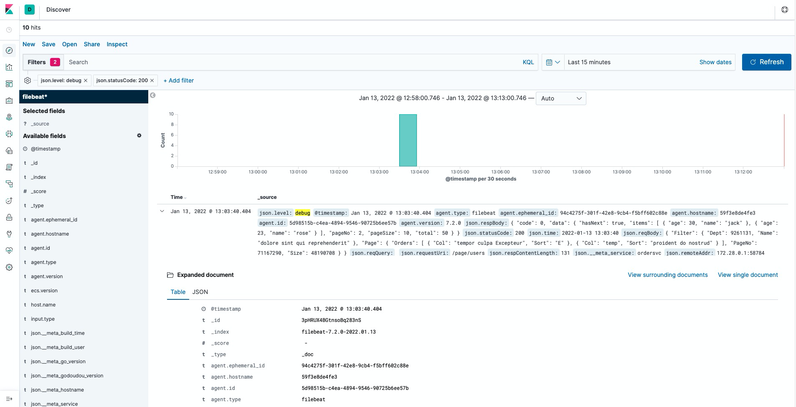
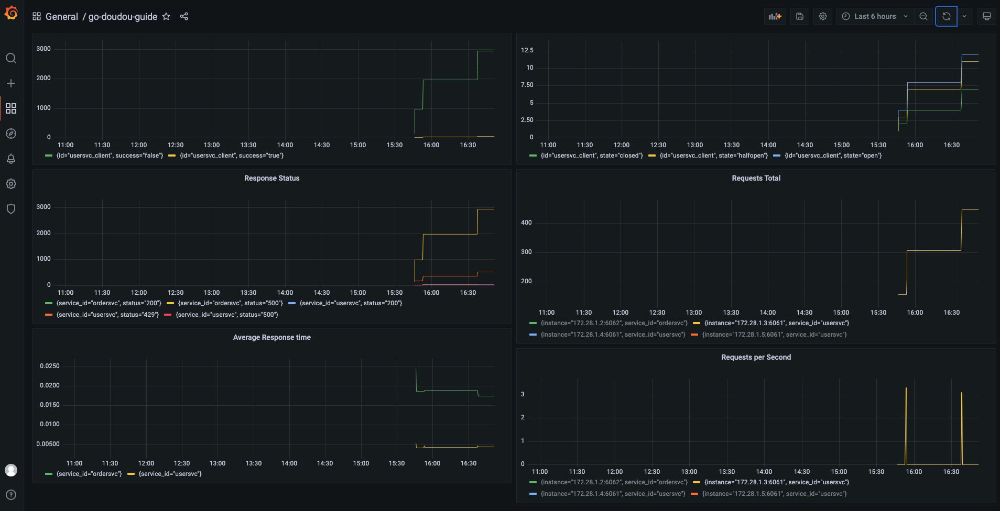

## go-doudou

[](https://github.com/avelino/awesome-go)
[](https://godoc.org/github.com/unionj-cloud/go-doudou)
[](https://travis-ci.com/unionj-cloud/go-doudou)
[](https://github.com/unionj-cloud/go-doudou/actions/workflows/go.yml)
[](https://codecov.io/gh/unionj-cloud/go-doudou)
[](https://goreportcard.com/report/github.com/unionj-cloud/go-doudou)
[](https://github.com/unionj-cloud/go-doudou)
[](https://goproxy.cn)
[](https://opensource.org/licenses/MIT)
[](https://join.slack.com/t/go-doudou/shared_invite/zt-xzohc7ds-u7~aio6B8PELp5UtAdY~uw)
[](https://wakatime.com/badge/user/852bcf22-8a37-460a-a8e2-115833174eba/project/57c830f7-e507-4cb1-9fd1-feedd96685f6)

[EN](./README.md) [中文](./README_zh.md)  
go-doudou（doudou pronounce /dəudəu/）is a gossip protocol and OpenAPI 3.0 spec based decentralized microservice
framework. It supports monolith service application as well. Currently, it supports restful service only.


<!-- START doctoc generated TOC please keep comment here to allow auto update -->
<!-- DON'T EDIT THIS SECTION, INSTEAD RE-RUN doctoc TO UPDATE -->
### TOC

  - [Why?](#why)
    - [Background](#background)
    - [Reason](#reason)
    - [Result](#result)
  - [Philosophy](#philosophy)
  - [Features](#features)
  - [Overview](#overview)
  - [Recommend Architecture](#recommend-architecture)
  - [Golang Version Support](#golang-version-support)
  - [Install](#install)
  - [Usage](#usage)
  - [Hello World](#hello-world)
    - [Initialize project](#initialize-project)
    - [Define methods](#define-methods)
    - [Generate code](#generate-code)
    - [Run](#run)
    - [Deployment](#deployment)
      - [Build docker image and push to your repository](#build-docker-image-and-push-to-your-repository)
      - [Deploy](#deploy)
      - [Shutdown](#shutdown)
  - [Must Know](#must-know)
  - [Cors](#cors)
  - [Service register & discovery](#service-register--discovery)
  - [Client Load Balancing](#client-load-balancing)
    - [Simple Round-robin Load Balancing](#simple-round-robin-load-balancing)
    - [Smooth Weighted Round-robin Balancing](#smooth-weighted-round-robin-balancing)
  - [Rate Limit](#rate-limit)
    - [Usage](#usage-1)
    - [Example](#example)
  - [Bulkhead](#bulkhead)
    - [Usage](#usage-2)
    - [Example](#example-1)
  - [Circuit Breaker / Timeout / Retry](#circuit-breaker--timeout--retry)
    - [Usage](#usage-3)
    - [Example](#example-2)
  - [Log](#log)
    - [Usage](#usage-4)
    - [Example](#example-3)
    - [ELK stack](#elk-stack)
  - [Jaeger](#jaeger)
    - [Usage](#usage-5)
    - [Screenshot](#screenshot)
  - [Grafana / Prometheus](#grafana--prometheus)
    - [Usage](#usage-6)
    - [Screenshot](#screenshot-1)
  - [Configuration](#configuration)
  - [Example](#example-4)
  - [Notable tools](#notable-tools)
    - [name](#name)
    - [ddl](#ddl)
  - [TODO](#todo)
  - [Community](#community)
- [License](#license)

<!-- END doctoc generated TOC please keep comment here to allow auto update -->

### Why?
#### Background
- I'm lazy, and I believe there are many developers like me. 
- I'm not only an individual developer, but also a team leader with duty to make the whole team more productive
- I am from a small company, we can't afford to recruit many senior developers, so my team members have different dev levels
- I am from a small company, we don't have operation engineers


#### Reason
- I need a tool to generate as much code as possible for us: if we don't know anything about tcp/ip/http/RESTFul/grpc/protobuf such low level things, and service register/service discover/failure detection/load balancing such microservice things, ONLY we know is CRUD, we still can develop robust programs/services out before the deadline. But I can't find such tool or framework.
- I am a developer not an operation engineer, I don't like setting up many infrastructures myself. I mean I don't want to set up etcd or zookeeper cluster and maintain them myself. I find memberlist, a gossip library developed by hashicorp who also developed consul, so I decide to make a microservice framework using it to let every service discover each other by themselves.
- I am a frontend developer in my early career, I know what a frontend developer want. So I choose OpenAPI 3.0 as bridge between frontend and backend. And I want to provide my frontend team members not only online documentation, but also mock server which can generating fake responses.


#### Result
Go-doudou a RESTFul microservice framework(we will add grpc support soon) comes out, it's mainly inspired by 
- https://github.com/kujtimiihoxha/kit: a code generator cli for go-kit 
- https://github.com/hashicorp/memberlist: golang package for gossip based membership and failure detection
- https://spec.openapis.org/oas/v3.0.3: OpenAPI 3.0


### Philosophy

- Design First: We encourage designing your apis at the first place.
- Contract: We use OpenAPI 3.0 spec as a contract between server and client to reduce the communication cost between
  different dev teams and speed up development.
- Decentralization: We use gossip protocol to do service register and discovery to build a robust, scalable and
  decentralized service cluster. Thanks the awesome library memberlist by hashicorp.

### Features

- Low-code: design service interface to generate main function, routes, http handlers, mock service implementation, http
  client, OpenAPI 3.0 json spec and more.
- Support DNS address for service register and discovery
- Support monolith and microservices architecture
- Built-in client load balancing: currently only round-robin
- Built-in graceful shutdown
- Built-in live reloading by watching go files(not support windows)
- Built-in service apis documentation UI
- Built-in service registry UI
- Built-in prometheus middlewares: http_requests_total, response_status and http_response_time_seconds
- Built-in docker and k8s deployment support: dockerfile, deployment kind yaml file and statefulset kind yaml file
- Easy to learn, simple to use

### Overview


### Recommend Architecture


### Golang Version Support

- go 1.13, 1.14, 1.15 with GO111MODULE=on
- go 1.16+
- < go 1.13: not test, maybe support

### Install

```shell
go get -v github.com/unionj-cloud/go-doudou@v0.9.3
```

If you meet 410 Gone error, try below command:

```shell
export GOSUMDB=off && go get -v github.com/unionj-cloud/go-doudou@v0.9.3
```

### Usage

```shell
➜  ~ go-doudou -h                            
go-doudou works like a scaffolding tool but more than that. 
it lets api providers design their apis and help them code less. 
it generates openapi 3.0 spec json document for frontend developers or other api consumers to understand what apis there, 
consumers can import it into postman to debug and test, or upload it into some code generators to download client sdk.
it provides some useful components and middleware for constructing microservice cluster like service register and discovering, 
load balancing and so on. it just begins, more features will come out soon.

Usage:
  go-doudou [flags]
  go-doudou [command]

Available Commands:
  ddl         migration tool between database table structure and golang struct
  help        Help about any command
  name        bulk add or update struct fields json tag
  svc         generate or update service

Flags:
  -h, --help      help for go-doudou
  -v, --version   version for go-doudou

Use "go-doudou [command] --help" for more information about a command.
```

### Hello World

#### Initialize project

```shell
➜  ~ go-doudou svc init helloworld
1.16
helloworld
```

You can ignore the warning now.

```shell
➜  helloworld git:(master) ✗ ls -la -h
total 40
drwxr-xr-x   10 wubin1989  staff   320B  8 29 23:27 .
drwxr-xr-x+ 157 wubin1989  staff   4.9K  8 29 23:27 ..
-rw-r--r--    1 wubin1989  staff   2.0K  8 29 23:22 .env
drwxr-xr-x    5 wubin1989  staff   160B  8 29 23:26 .git
-rw-r--r--    1 wubin1989  staff   268B  8 29 23:22 .gitignore
drwxr-xr-x    6 wubin1989  staff   192B  8 29 23:27 .idea
-rw-r--r--    1 wubin1989  staff   707B  8 29 23:22 Dockerfile
-rw-r--r--    1 wubin1989  staff   442B  8 29 23:22 go.mod
-rw-r--r--    1 wubin1989  staff   253B  8 29 23:22 svc.go
drwxr-xr-x    3 wubin1989  staff    96B  8 29 23:22 vo
```

- Dockerfile：build docker image

- svc.go: design your rest apis by defining methods of Helloworld interface

- vo folder：define structs as data structure in http request body and response body, and also as OpenAPI 3.0 schemas

- .env: config file, go-doudou use it to load enviroment variables with GDD_ prefix

#### Define methods

Please read [Must Know](#must-know)

```go
package service

import (
	"context"
	"helloworld/vo"
)

type Helloworld interface {
	// You can define your service methods as your need. Below is an example.
	PageUsers(ctx context.Context, query vo.PageQuery) (code int, data vo.PageRet, err error)
}
```

#### Generate code

```shell
go-doudou svc http --handler -c go -o --doc
go mod tidy
```

Let's see what are generated.

```shell
➜  helloworld git:(master) ✗ ls -la -h
total 328
drwxr-xr-x   20 wubin1989  staff   640B  8 31 12:34 .
drwxr-xr-x+ 157 wubin1989  staff   4.9K  8 31 12:36 ..
-rw-r--r--    1 wubin1989  staff   2.0K  8 29 23:45 .env
drwxr-xr-x    5 wubin1989  staff   160B  8 31 12:36 .git
-rw-r--r--    1 wubin1989  staff   268B  8 29 23:22 .gitignore
drwxr-xr-x    7 wubin1989  staff   224B  8 31 12:33 .idea
-rw-r--r--    1 wubin1989  staff   707B  8 29 23:22 Dockerfile
-rwxr-xr-x    1 wubin1989  staff    13K  8 31 12:35 app.log
drwxr-xr-x    3 wubin1989  staff    96B  8 29 23:44 client
drwxr-xr-x    3 wubin1989  staff    96B  8 29 23:44 cmd
drwxr-xr-x    3 wubin1989  staff    96B  8 29 23:44 config
drwxr-xr-x    3 wubin1989  staff    96B  8 29 23:44 db
-rw-r--r--    1 wubin1989  staff   536B  8 31 12:35 go.mod
-rw-r--r--    1 wubin1989  staff   115K  8 31 12:35 go.sum
-rwxr-xr-x    1 wubin1989  staff   1.9K  8 31 12:34 helloworld_openapi3.go
-rwxr-xr-x    1 wubin1989  staff   1.8K  8 31 12:34 helloworld_openapi3.json
-rw-r--r--    1 wubin1989  staff   253B  8 29 23:22 svc.go
-rw-r--r--    1 wubin1989  staff   413B  8 29 23:44 svcimpl.go
drwxr-xr-x    3 wubin1989  staff    96B  8 29 23:44 transport
drwxr-xr-x    3 wubin1989  staff    96B  8 29 23:22 vo
```

- helloworld_openapi3.json：OpenAPI 3.0 spec json documentation
- helloworld_openapi3.go: assign OpenAPI 3.0 spec json string to a variable for serving online
- client：golang http client based on [resty](https://github.com/go-resty/resty)
- cmd：main.go file here
- config：config loading related
- db：function for connecting to database
- svcimpl.go：write your business logic here
- transport：http routes and handlers
- .env：put configs here

#### Run

Set GDD_MEM_SEED empty in .env file because there is no seed address before run our service now.

```shell
➜  helloworld git:(master) ✗ go run cmd/main.go
INFO[2021-08-31 21:35:47] Node 192.168.2.20 joined, supplying helloworld service 
WARN[2021-08-31 21:35:47] No seed found                                
INFO[2021-08-31 21:35:47] Memberlist created. Local node is Node 192.168.2.20, providing helloworld service at http://192.168.2.20:6060, memberlist port 50324 
 _____                     _                    _
|  __ \                   | |                  | |
| |  \/  ___   ______   __| |  ___   _   _   __| |  ___   _   _
| | __  / _ \ |______| / _` | / _ \ | | | | / _` | / _ \ | | | |
| |_\ \| (_) |        | (_| || (_) || |_| || (_| || (_) || |_| |
 \____/ \___/          \__,_| \___/  \__,_| \__,_| \___/  \__,_|
INFO[2021-08-31 21:35:47] ================ Registered Routes ================ 
INFO[2021-08-31 21:35:47] +-------------+--------+-------------------------+ 
INFO[2021-08-31 21:35:47] |    NAME     | METHOD |         PATTERN         | 
INFO[2021-08-31 21:35:47] +-------------+--------+-------------------------+ 
INFO[2021-08-31 21:35:47] | PageUsers   | POST   | /page/users             | 
INFO[2021-08-31 21:35:47] | GetDoc      | GET    | /go-doudou/doc          | 
INFO[2021-08-31 21:35:47] | GetOpenAPI  | GET    | /go-doudou/openapi.json | 
INFO[2021-08-31 21:35:47] | Prometheus  | GET    | /go-doudou/prometheus   | 
INFO[2021-08-31 21:35:47] | GetRegistry | GET    | /go-doudou/registry     | 
INFO[2021-08-31 21:35:47] +-------------+--------+-------------------------+ 
INFO[2021-08-31 21:35:47] =================================================== 
INFO[2021-08-31 21:35:47] Started in 431.269µs                         
INFO[2021-08-31 21:35:47] Http server is listening on :6060
```


#### Deployment

##### Build docker image and push to your repository

```shell
➜  helloworld git:(master) ✗ go-doudou svc push -r wubin1989
[+] Building 0.8s (13/13) FINISHED                                                                                                       
 => [internal] load build definition from Dockerfile                                                                                0.0s
 => => transferring dockerfile: 37B                                                                                                 0.0s
 => [internal] load .dockerignore                                                                                                   0.0s
 => => transferring context: 2B                                                                                                     0.0s
 => [internal] load metadata for docker.io/library/golang:1.13.4-alpine                                                             0.0s
 => [1/8] FROM docker.io/library/golang:1.13.4-alpine                                                                               0.0s
 => [internal] load build context                                                                                                   0.7s
 => => transferring context: 22.43MB                                                                                                0.6s
 => CACHED [2/8] WORKDIR /repo                                                                                                      0.0s
 => CACHED [3/8] ADD go.mod .                                                                                                       0.0s
 => CACHED [4/8] ADD go.sum .                                                                                                       0.0s
 => CACHED [5/8] ADD . ./                                                                                                           0.0s
 => CACHED [6/8] RUN sed -i 's/dl-cdn.alpinelinux.org/mirrors.aliyun.com/g' /etc/apk/repositories                                   0.0s
 => CACHED [7/8] RUN apk add --no-cache bash tzdata                                                                                 0.0s
 => CACHED [8/8] RUN export GDD_VER=$(go list -mod=vendor -m -f '{{ .Version }}' github.com/unionj-cloud/go-doudou) && CGO_ENABLED  0.0s
 => exporting to image                                                                                                              0.0s
 => => exporting layers                                                                                                             0.0s
 => => writing image sha256:00365c58d0410d978aea462ec93323e20d879b15421e8eba29d8a17918660af8                                        0.0s
 => => naming to docker.io/library/helloworld                                                                                       0.0s

Use 'docker scan' to run Snyk tests against images to find vulnerabilities and learn how to fix them
The push refers to repository [docker.io/wubin1989/helloworld]
d0a9599b03e1: Pushed 
c3055fdf1a79: Layer already exists 
1c265a7f4c3e: Layer already exists 
f567cf5a5cf1: Layer already exists 
0b4acd902364: Layer already exists 
bbf9670b59e9: Layer already exists 
fdd6fb6fca5b: Layer already exists 
a17f85ec7605: Layer already exists 
2895b872dff5: Layer already exists 
eed8c158e67f: Layer already exists 
2033402d2275: Layer already exists 
77cae8ab23bf: Layer already exists 
v20210831125525: digest: sha256:5f75f7b43708d0619555f9bccbf0347e8db65319b83c65251015982ca6d23370 size: 2829
time="2021-08-31 12:55:53" level=info msg="image wubin1989/helloworld:v20210831125525 has been pushed successfully\n"
time="2021-08-31 12:55:53" level=info msg="k8s yaml has been created/updated successfully. execute command 'go-doudou svc deploy' to deploy service helloworld to k8s cluster\n"
```

then you should see there are two yaml files generated

```
➜  helloworld git:(master) ✗ ll
total 328
-rw-r--r--  1 wubin1989  staff   707B  8 29 23:22 Dockerfile
-rwxr-xr-x  1 wubin1989  staff    15K  8 31 12:55 app.log
drwxr-xr-x  3 wubin1989  staff    96B  8 29 23:44 client
drwxr-xr-x  3 wubin1989  staff    96B  8 29 23:44 cmd
drwxr-xr-x  3 wubin1989  staff    96B  8 29 23:44 config
drwxr-xr-x  3 wubin1989  staff    96B  8 29 23:44 db
-rw-r--r--  1 wubin1989  staff   536B  8 31 12:35 go.mod
-rw-r--r--  1 wubin1989  staff   115K  8 31 12:35 go.sum
-rw-r--r--  1 wubin1989  staff   817B  8 31 12:55 helloworld_deployment.yaml
-rwxr-xr-x  1 wubin1989  staff   1.9K  8 31 12:34 helloworld_openapi3.go
-rwxr-xr-x  1 wubin1989  staff   1.8K  8 31 12:34 helloworld_openapi3.json
-rw-r--r--  1 wubin1989  staff   867B  8 31 12:55 helloworld_statefulset.yaml
-rw-r--r--  1 wubin1989  staff   253B  8 29 23:22 svc.go
-rw-r--r--  1 wubin1989  staff   413B  8 29 23:44 svcimpl.go
drwxr-xr-x  3 wubin1989  staff    96B  8 29 23:44 transport
drwxr-xr-x  6 wubin1989  staff   192B  8 31 12:55 vendor
drwxr-xr-x  3 wubin1989  staff    96B  8 29 23:22 vo
```

- helloworld_deployment.yaml: k8s deploy file for stateless service, recommend for monolith architecture services
- helloworld_statefulset.yaml: k8s deploy file for stateful service, recommend for microservices architecture services

##### Deploy

```shell
go-doudou svc deploy 
```

##### Shutdown

```shell
go-doudou svc shutdown
```

### Must Know

There are some constraints or notable things when you define your methods as exposed apis for client in svc.go file.

1. Only support GET, POST, PUT, DELETE http methods. If method name starts with one of Get/Post/Put/Delete, http method
   will be one of GET/POST/PUT/DELETE. If method name doesn't start with any of them, default http method is POST.
2. First input parameter MUST be context.Context.
3. Only support golang [built-in types](https://golang.org/pkg/builtin/), map with string key, custom structs in vo
   package, corresponding slice and pointer types for input and output parameters. When go-doudou generate code and
   OpenAPI 3.0 spec, it will scan structs in vo package. If there is a struct from other package, the struct fields
   cannot be known by go-doudou.
4. As special cases, it supports multipart.FileHeader for uploading file as input parameter, supports os.File for
   downloading file as output parameter.
5. NOT support alias types as field of a struct.
6. NOT support func, channel, interface and anonymous struct type as input and output parameter.
7. When execute  `go-doudou svc http --handler` , existing code in handlerimpl.go won't be overwritten. If you added
   methods in svc.go, new code will be appended to handlerimpl.go.
8. When execute  `go-doudou svc http --handler` , existing code in handler.go will be overwritten, so don't modify
   handler.go file.
9. When execute  `go-doudou svc http`, only handler.go file will be overwritten and others will be checked if exists, if
   already exists, do nothing.

### Cors
Recommend to use [github.com/rs/cors](github.com/rs/cors) library. Here is example code.
```
corsOpts := cors.New(cors.Options{
    AllowedMethods: []string{
        http.MethodGet,
        http.MethodPost,
        http.MethodPut,
        http.MethodPatch,
        http.MethodDelete,
        http.MethodOptions,
        http.MethodHead,
    },

    AllowedHeaders: []string{
        "*",
    },
})

srv := ddhttp.NewDefaultHttpSrv()
srv.AddMiddleware(corsOpts.Handler, ddhttp.Tracing, ddhttp.Metrics, requestid.RequestIDHandler, handlers.CompressHandler, handlers.ProxyHeaders, ddhttp.Logger, ddhttp.Rest)
```

### Service register & discovery

Go-doudou supports monolith and microservices architecture.
Add below code to enable microservices architecture:
```go
err := registry.NewNode()
if err != nil {
    logrus.Panicln(fmt.Sprintf("%+v", err))
}
defer registry.Shutdown()
```

### Client Load Balancing

#### Simple Round-robin Load Balancing

```go
package main

import (
	"fmt"
	"github.com/ascarter/requestid"
	"github.com/gorilla/handlers"
	"github.com/sirupsen/logrus"
	ddconfig "github.com/unionj-cloud/go-doudou/svc/config"
	ddhttp "github.com/unionj-cloud/go-doudou/svc/http"
	"github.com/unionj-cloud/go-doudou/svc/registry"
	service "ordersvc"
	"ordersvc/config"
	"ordersvc/transport/httpsrv"
	"usersvc/client"
)

func main() {
	ddconfig.InitEnv()
	conf := config.LoadFromEnv()

	err := registry.NewNode()
	if err != nil {
		logrus.Panicln(fmt.Sprintf("%+v", err))
	}
	defer registry.Shutdown()

	usersvcProvider := ddhttp.NewMemberlistServiceProvider("github.com/usersvc")
	usersvcClient := client.NewUsersvc(ddhttp.WithProvider(usersvcProvider))

	svc := service.NewOrdersvc(conf, nil, usersvcClient)

	handler := httpsrv.NewOrdersvcHandler(svc)
	srv := ddhttp.NewDefaultHttpSrv()
	srv.AddMiddleware(ddhttp.Tracing, ddhttp.Metrics, requestid.RequestIDHandler, handlers.CompressHandler, handlers.ProxyHeaders, ddhttp.Logger, ddhttp.Rest, ddhttp.Recover)
	srv.AddRoute(httpsrv.Routes(handler)...)
	srv.Run()
}
```

#### Smooth Weighted Round-robin Balancing

If environment variable GDD_MEM_WEIGHT is not set, local node weight will be calculated by health score and cpu idle
percent every GDD_MEM_WEIGHT_INTERVAL and gossip to remote nodes.

```go
package main

import (
	"fmt"
	"github.com/ascarter/requestid"
	"github.com/gorilla/handlers"
	"github.com/sirupsen/logrus"
	ddconfig "github.com/unionj-cloud/go-doudou/svc/config"
	ddhttp "github.com/unionj-cloud/go-doudou/svc/http"
	"github.com/unionj-cloud/go-doudou/svc/registry"
	service "ordersvc"
	"ordersvc/config"
	"ordersvc/transport/httpsrv"
	"usersvc/client"
)

func main() {
	ddconfig.InitEnv()
	conf := config.LoadFromEnv()

	err := registry.NewNode()
	if err != nil {
		logrus.Panicln(fmt.Sprintf("%+v", err))
	}
	defer registry.Shutdown()

	usersvcProvider := ddhttp.NewSmoothWeightedRoundRobinProvider("github.com/usersvc")
	usersvcClient := client.NewUsersvc(ddhttp.WithProvider(usersvcProvider))

	svc := service.NewOrdersvc(conf, nil, usersvcClient)

	handler := httpsrv.NewOrdersvcHandler(svc)
	srv := ddhttp.NewDefaultHttpSrv()
	srv.AddMiddleware(ddhttp.Tracing, ddhttp.Metrics, requestid.RequestIDHandler, handlers.CompressHandler, handlers.ProxyHeaders, ddhttp.Logger, ddhttp.Rest, ddhttp.Recover)
	srv.AddRoute(httpsrv.Routes(handler)...)
	srv.Run()
}
```

### Rate Limit
#### Usage
There is a built-in [golang.org/x/time/rate](https://pkg.go.dev/golang.org/x/time/rate) based token-bucket rate limiter implementation
in github.com/unionj-cloud/go-doudou/ratelimit package with a `MemoryStore` struct for storing key and `Limiter` instance pairs.

Pass `Limiter` instance getter function to `ratelimit.WithLimiterFn` as parameter and then pass them to `ratelimit.NewMemoryStore` 
to get a `MemoryStore` instance. Then you can pass it to your custom http middleware to implement your business logic to limit requests.

If you don't like the built-in rate limiter implementation, you can implement `Limiter` interface by yourself.

You can pass an option function `ratelimit.WithTimer` to `ratelimit.NewTokenLimiter` function to set a timer to each of 
`TokenLimiter` instance returned for deleting the key in `keys` of the `MemoryStore` instance if it has been idle for `timeout` duration.

#### Example

```go
package main

import (
	"fmt"
	"github.com/ascarter/requestid"
	"github.com/gorilla/handlers"
	"github.com/opentracing/opentracing-go"
	"github.com/sirupsen/logrus"
	"github.com/unionj-cloud/go-doudou/ratelimit"
	ddconfig "github.com/unionj-cloud/go-doudou/svc/config"
	ddhttp "github.com/unionj-cloud/go-doudou/svc/http"
	"github.com/unionj-cloud/go-doudou/svc/logger"
	"github.com/unionj-cloud/go-doudou/svc/registry"
	"github.com/unionj-cloud/go-doudou/svc/tracing"
	"time"
	service "usersvc"
	"usersvc/config"
	"usersvc/transport/httpsrv"
)

func main() {
	ddconfig.InitEnv()
	conf := config.LoadFromEnv()

	logger.Init()

	err := registry.NewNode()
	if err != nil {
		logrus.Panicln(fmt.Sprintf("%+v", err))
	}
	defer registry.Shutdown()

	tracer, closer := tracing.Init()
	defer closer.Close()
	opentracing.SetGlobalTracer(tracer)

	svc := service.NewUsersvc(conf)

	handler := httpsrv.NewUsersvcHandler(svc)
	srv := ddhttp.NewDefaultHttpSrv()

	store := ratelimit.NewMemoryStore(ratelimit.WithLimiterFn(func(store *ratelimit.MemoryStore, key string) ratelimit.Limiter {
		return ratelimit.NewTokenLimiter(1, 3, ratelimit.WithTimer(10*time.Second, func() {
			store.DeleteKey(key)
		}))
	}))

	srv.AddMiddleware(ddhttp.Tracing, ddhttp.Metrics, requestid.RequestIDHandler, handlers.CompressHandler, handlers.ProxyHeaders, httpsrv.RateLimit(store), ddhttp.Logger, ddhttp.Rest, ddhttp.Recover)
	srv.AddRoute(httpsrv.Routes(handler)...)
	srv.Run()
}
```

### Bulkhead
#### Usage
There is built-in [github.com/slok/goresilience](github.com/slok/goresilience) based bulkhead pattern support by BulkHead middleware in `github.com/unionj-cloud/go-doudou/svc/http` package.

```go
http.BulkHead(3, 10*time.Millisecond)
```

In above code, the first parameter `3` means the number of workers in the execution pool, the second parameter `10*time.Millisecond` 
means the max time an incoming request will wait to execute before being dropped its execution and return `429` response.

#### Example

```go
package main

import (
	"fmt"
	"github.com/ascarter/requestid"
	"github.com/gorilla/handlers"
	"github.com/opentracing/opentracing-go"
	"github.com/sirupsen/logrus"
	ddconfig "github.com/unionj-cloud/go-doudou/svc/config"
	ddhttp "github.com/unionj-cloud/go-doudou/svc/http"
	"github.com/unionj-cloud/go-doudou/svc/logger"
	"github.com/unionj-cloud/go-doudou/svc/registry"
	"github.com/unionj-cloud/go-doudou/svc/tracing"
	"time"
	service "usersvc"
	"usersvc/config"
	"usersvc/transport/httpsrv"
)

func main() {
	ddconfig.InitEnv()
	conf := config.LoadFromEnv()

	logger.Init()

	if ddconfig.GddMode.Load() == "micro" {
		err := registry.NewNode()
		if err != nil {
			logrus.Panicln(fmt.Sprintf("%+v", err))
		}
		defer registry.Shutdown()
	}

	tracer, closer := tracing.Init()
	defer closer.Close()
	opentracing.SetGlobalTracer(tracer)

	svc := service.NewUsersvc(conf)

	handler := httpsrv.NewUsersvcHandler(svc)
	srv := ddhttp.NewDefaultHttpSrv()

	srv.AddMiddleware(ddhttp.Tracing, ddhttp.Metrics, ddhttp.BulkHead(1, 10*time.Millisecond), requestid.RequestIDHandler, handlers.CompressHandler, handlers.ProxyHeaders, ddhttp.Logger, ddhttp.Rest, ddhttp.Recover)
	srv.AddRoute(httpsrv.Routes(handler)...)
	srv.Run()
}
```

### Circuit Breaker / Timeout / Retry 
#### Usage
There is built-in [github.com/slok/goresilience](github.com/slok/goresilience) based Circuit Breaker / Timeout / Retry support in generated client code.
You don't need to do anything other than executing command: 
```shell
go-doudou svc http --handler -c go --doc
```  
The flag  `-c go` means generate go client code.
Then you will get two files in client folder: 
```shell
➜  usersvc git:(master) ✗ cd client    
➜  client git:(master) ✗ ll
total 32
-rw-r--r--  1 wubin1989  staff   7.9K  1 10 17:16 client.go
-rw-r--r--  1 wubin1989  staff   5.4K  1 10 17:16 clientproxy.go
```
For `client.go` file, all code will be overwritten each time you execute generation command.  
For `clientproxy.go` file, the existing code will not be changed, only new code will be appended. 

There is a default `goresilience.Runner` instance which has already been built-in circuit breaker, timeout and retry features for you, 
but if you need to customize it, you can pass `WithRunner(your_own_runner goresilience.Runner)` as `ProxyOption` parameter into 
`NewXXXClientProxy` function.

#### Example
```go 
package main

import (
	"fmt"
	"github.com/ascarter/requestid"
	"github.com/gorilla/handlers"
	"github.com/opentracing/opentracing-go"
	"github.com/sirupsen/logrus"
	ddconfig "github.com/unionj-cloud/go-doudou/svc/config"
	ddhttp "github.com/unionj-cloud/go-doudou/svc/http"

	"github.com/unionj-cloud/go-doudou/svc/logger"
	"github.com/unionj-cloud/go-doudou/svc/registry"
	"github.com/unionj-cloud/go-doudou/svc/tracing"
	service "ordersvc"
	"ordersvc/config"
	"ordersvc/transport/httpsrv"
	"usersvc/client"
)

func main() {
	ddconfig.InitEnv()
	conf := config.LoadFromEnv()

	logger.Init()

	err := registry.NewNode()
	if err != nil {
		logrus.Panicln(fmt.Sprintf("%+v", err))
	}
	defer registry.Shutdown()

	tracer, closer := tracing.Init()
	defer closer.Close()
	opentracing.SetGlobalTracer(tracer)

	usersvcProvider := ddhttp.NewSmoothWeightedRoundRobinProvider("usersvc")
	usersvcClient := client.NewUsersvc(ddhttp.WithProvider(usersvcProvider))
	// if you don't need this resilience feature, you don't have to new the instance usersvcClientProxy.
	// you can just use usersvcClient.
	usersvcClientProxy := client.NewUsersvcClientProxy(usersvcClient)

	svc := service.NewOrdersvc(conf, nil, usersvcClientProxy)

	handler := httpsrv.NewOrdersvcHandler(svc)
	srv := ddhttp.NewDefaultHttpSrv()
	srv.AddMiddleware(ddhttp.Tracing, ddhttp.Metrics, requestid.RequestIDHandler, handlers.CompressHandler, handlers.ProxyHeaders, ddhttp.Logger, ddhttp.Rest, ddhttp.Recover)
	srv.AddRoute(httpsrv.Routes(handler)...)
	srv.Run()
}
```

### Log
#### Usage
There is a global `logrus.Entry` provided by `github.com/unionj-cloud/go-doudou/svc/logger` package. If `GDD_ENV` is set and is not set to `dev`,
it will be attached with some meta fields about service name, hostname, etc.

`logger` package implemented several exported package-level methods from `logrus`, so you can replace `logrus.Info()` with `logger.Info()` for example.
It also provided a `Init` function to help you configure `logrus.Logger` instance.

You can also configure log level by environment variable `GDD_LOG_LEVEL` and configure formatter type to `json` or `text` by environment variable `GDD_LOG_FORMAT`.

There are two built-in log related middlewares for you, `ddhttp.Metrics` and `ddhttp.Logger`. In short, `ddhttp.Metrics` is for printing brief log with limited 
information, while `ddhttp.Logger` is for printing detail log with request and response body, headers, opentracing span and some other information, and it only takes 
effect when environment variable `GDD_LOG_LEVEL` is set to `debug`.

#### Example
```go 
// you can use lumberjack to add log rotate feature to your service
logger.Init(logger.WithWritter(io.MultiWriter(os.Stdout, &lumberjack.Logger{
    Filename:   filepath.Join(os.Getenv("LOG_PATH"), fmt.Sprintf("%s.log", ddconfig.GddServiceName.Load())),
    MaxSize:    5,  // Max megabytes before log is rotated
    MaxBackups: 10, // Max number of old log files to keep
    MaxAge:     7,  // Max number of days to retain log files
    Compress:   true,
})))
```

#### ELK stack
`logger` package provided well support for ELK stack. To see example, please go to [go-doudou-guide](https://github.com/unionj-cloud/go-doudou-guide).



### Jaeger
#### Usage
To add jaeger feature, you just need three steps:
1. Start jaeger
```shell
docker run -d --name jaeger \
  -p 6831:6831/udp \
  -p 16686:16686 \
  jaegertracing/all-in-one:1.29
```
2. Add two environment variables to your .env file
```shell
JAEGER_AGENT_HOST=localhost
JAEGER_AGENT_PORT=6831
```
3. Add three lines to your main function before new client and http server code
```go
tracer, closer := tracing.Init()
defer closer.Close()
opentracing.SetGlobalTracer(tracer)
```
Then your main function should like this
```go
package main

import (
	"fmt"
	"github.com/ascarter/requestid"
	"github.com/gorilla/handlers"
	"github.com/opentracing/opentracing-go"
	"github.com/sirupsen/logrus"
	ddconfig "github.com/unionj-cloud/go-doudou/svc/config"
	ddhttp "github.com/unionj-cloud/go-doudou/svc/http"
	"github.com/unionj-cloud/go-doudou/svc/logger"
	"github.com/unionj-cloud/go-doudou/svc/registry"
	"github.com/unionj-cloud/go-doudou/svc/tracing"
	service "ordersvc"
	"ordersvc/config"
	"ordersvc/transport/httpsrv"
	"usersvc/client"
)

func main() {
	ddconfig.InitEnv()
	conf := config.LoadFromEnv()

	logger.Init()

	err := registry.NewNode()
	if err != nil {
		logrus.Panicln(fmt.Sprintf("%+v", err))
	}
	defer registry.Shutdown()

	tracer, closer := tracing.Init()
	defer closer.Close()
	opentracing.SetGlobalTracer(tracer)

	usersvcProvider := ddhttp.NewSmoothWeightedRoundRobinProvider("usersvc")
	usersvcClient := client.NewUsersvc(ddhttp.WithProvider(usersvcProvider))

	svc := service.NewOrdersvc(conf, nil, usersvcClient)

	handler := httpsrv.NewOrdersvcHandler(svc)
	srv := ddhttp.NewDefaultHttpSrv()
	srv.AddMiddleware(ddhttp.Tracing, ddhttp.Metrics, requestid.RequestIDHandler, handlers.CompressHandler, handlers.ProxyHeaders, ddhttp.Logger, ddhttp.Rest, ddhttp.Recover)
	srv.AddRoute(httpsrv.Routes(handler)...)
	srv.Run()
}
```
#### Screenshot


### Grafana / Prometheus
#### Usage
We implemented a service called `seed` for Prometheus service discovery based on [this blog](https://prometheus.io/blog/2018/07/05/implementing-custom-sd/).
Its source code is in [go-doudou-guide](https://github.com/unionj-cloud/go-doudou-guide) repo.

#### Screenshot


### Configuration

Go-doudou use .env file to load environment variables to configure behaviors.

| Environment Variable    | Description                                                                                                                                                                                                                                                                        | Default   | Required |
| ----------------------- |------------------------------------------------------------------------------------------------------------------------------------------------------------------------------------------------------------------------------------------------------------------------------------|-----------| -------- |
| GDD_BANNER              | Whether output banner to stdout or not, possible values are on and off.                                                                                                                                                                                                            | off       |          |
| GDD_BANNER_TEXT         |                                                                                                                                                                                                                                                                                    | Go-doudou |          |
| GDD_LOG_LEVEL           | Possible values are panic, fatal, error, warn, warning, info, debug, trace                                                                                                                                                                                                         | info      |          |
| GDD_LOG_FORMAT            | Set log format to text or json, accept values are text and json                                                                                                                                                                                                                    |   text        |          |
| GDD_GRACE_TIMEOUT       | Graceful shutdown timeout for http server                                                                                                                                                                                                                                          | 15s       |          |
| GDD_WRITE_TIMEOUT       | Configure http.Server                                                                                                                                                                                                                                                              | 15s       |          |
| GDD_READ_TIMEOUT        | Configure http.Server                                                                                                                                                                                                                                                              | 15s       |          |
| GDD_IDLE_TIMEOUT        | Configure http.Server                                                                                                                                                                                                                                                              | 60s       |          |
| GDD_ROUTE_ROOT_PATH     | prefix GDD_ROUTE_ROOT_PATH to each of http api routes                                                                                                                                                                                                                              | ""        |          |
| GDD_SERVICE_NAME        | Service name that the node providing in the cluster.                                                                                                                                                                                                                               |           | Yes      |
| GDD_HOST                | Configure http.Server. Specifying host for the http server to listen on.                                                                                                                                                                                                           | ""        |          |
| GDD_PORT                | Configure http.Server. Specifying port for the http server to listen on.                                                                                                                                                                                                           | ""        |          |
| GDD_MODE                | Accept "mono" for monolith mode or "micro" for microservice mode                                                                                                                                                                                                                   |           |          |
| GDD_MANAGE_ENABLE       | Enable built-in api endpoints such as /go-doudou/doc, /go-doudou/openapi.json, /go-doudou/prometheus and /go-doudou/registry. Possible values are true and false.                                                                                                                  | false     |          |
| GDD_MANAGE_USER         | Http basic username for built-in api endpoints                                                                                                                                                                                                                                     | ""        |          |
| GDD_MANAGE_PASS         | Http basic password for built-in api endpoints                                                                                                                                                                                                                                     | ""        |          |
| GDD_MEM_SEED            | Seed address for join memberlist cluster. If empty or not set, this node will create a new cluster for other nodes to join.                                                                                                                                                        | ""        |          |
| GDD_MEM_NAME            | Only for dev and test use. Unique name of this node in cluster. if empty or not set, hostname will be used instead.                                                                                                                                                                | ""        |          |
| GDD_MEM_HOST            | Specify AdvertiseAddr attribute of memberlist config struct. if GDD_MEM_HOST starts with dot such as .seed-svc-headless.default.svc.cluster.local, it will be prefixed by hostname such as seed-2.seed-svc-headless.default.svc.cluster.local for supporting k8s stateful service. | ""        |          |
| GDD_MEM_PORT            | If empty or not set, an available port will be chosen randomly. Recommend specifying a port.                                                                                                                                                                                       | ""        |          |
| GDD_MEM_DEAD_TIMEOUT    | Dead node will be removed from node map if not received refute messages from it in GDD_MEM_DEAD_TIMEOUT duration                                                                                                                                                                   | 30s       |          |
| GDD_MEM_SYNC_INTERVAL   | Local node will synchronize states from other random node every GDD_MEM_SYNC_INTERVAL duration                                                                                                                                                                                     | 10s       |          |
| GDD_MEM_RECLAIM_TIMEOUT | Dead node will be replaced with new node with the same name but different full address in GDD_MEM_RECLAIM_TIMEOUT duration                                                                                                                                                         | 3s        |          |
| GDD_MEM_PROBE_INTERVAL | Do failure detecting every GDD_MEM_PROBE_INTERVAL duration                                                                                                                                                                                                                         | 5s        |          |
| GDD_MEM_PROBE_TIMEOUT | Probe fail if not receive ack message in GDD_MEM_PROBE_TIMEOUT duration                                                                                                                                                                                                            | 3s        |          |
| GDD_MEM_TCP_TIMEOUT | TCP request will timeout in GDD_MEM_TCP_TIMEOUT duration                                                                                                                                                                                                                           | 30s       |          |
| GDD_MEM_GOSSIP_NODES | Specify how many remote nodes you want to send gossip messages                                                                                                                                                                                                                     | 4         |          |
| GDD_MEM_GOSSIP_INTERVAL | Gossip messages in queue every GDD_MEM_GOSSIP_INTERVAL duration                                                                                                                                                                                                                    | 500ms     |          |
| GDD_MEM_SUSPICION_MULT | The multiplier for determining the time an inaccessible node is considered suspect before declaring it dead                                                                                                                                                                        | 6         |          |
| GDD_MEM_WEIGHT | Node weight for smooth weighted round-robin balancing                                                                                                                                                                                                                              | 0         |          |
| GDD_MEM_WEIGHT_INTERVAL | Node weight will be calculated every GDD_MEM_WEIGHT_INTERVAL                                                                                                                                                                                                                       | 5s        |          |
| GDD_RETRY_COUNT | Set resty client retry count                                                                                                                                                                                                                                                       | 0         |          |

### Example

Please check [go-doudou-guide](https://github.com/unionj-cloud/go-doudou-guide)

### Notable tools

#### name

Command line tool for generating json tag of struct field. Please check [document ](./name/README.md).

#### ddl

DDL and dao layer generation command line tool based on [jmoiron/sqlx](https://github.com/jmoiron/sqlx). Please
check [document](./ddl/doc/README.md).

### TODO

Please reference [go-doudou kanban](https://github.com/unionj-cloud/go-doudou/projects/1)

### Community

Welcome to contribute to go-doudou by forking it and submitting pr or issues. If you like go-doudou, please give it a
star!

Slack invitation link: https://join.slack.com/t/go-doudou/shared_invite/zt-xzohc7ds-u7~aio6B8PELp5UtAdY~uw

Welcome to contact me from

- facebook: [https://www.facebook.com/bin.wu.94617999/](https://www.facebook.com/bin.wu.94617999/)
- twitter: [https://twitter.com/BINWU49205513](https://twitter.com/BINWU49205513)
- email: 328454505@qq.com
- wechat:  
  

## License

MIT
