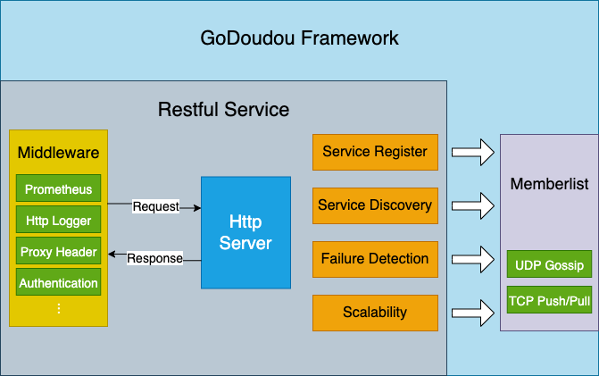
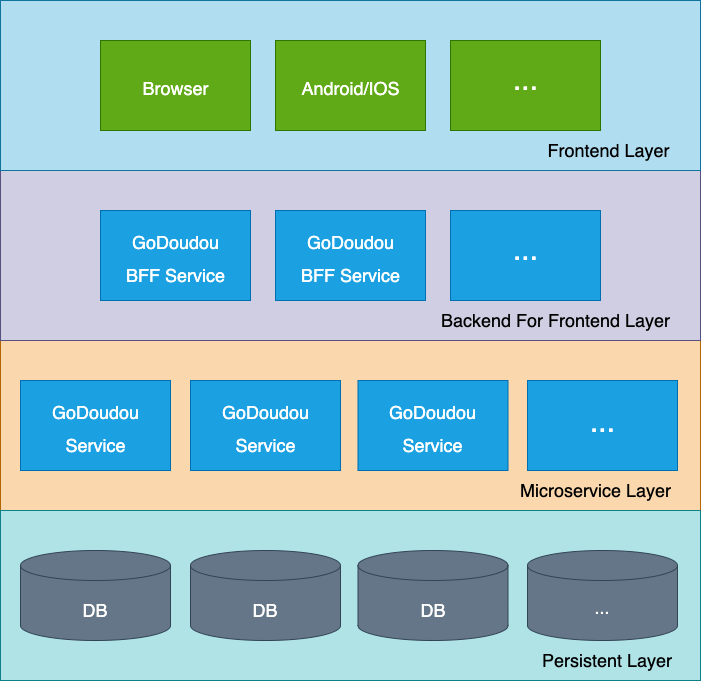
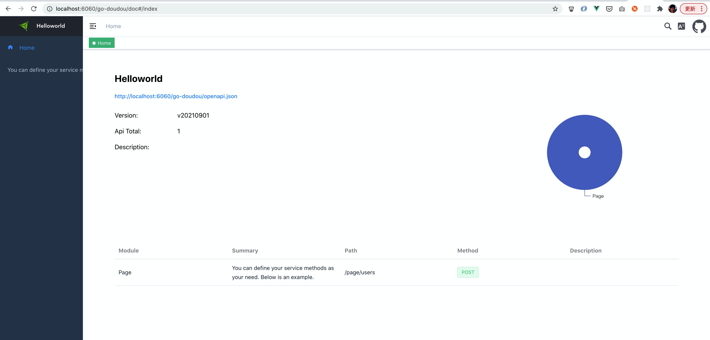
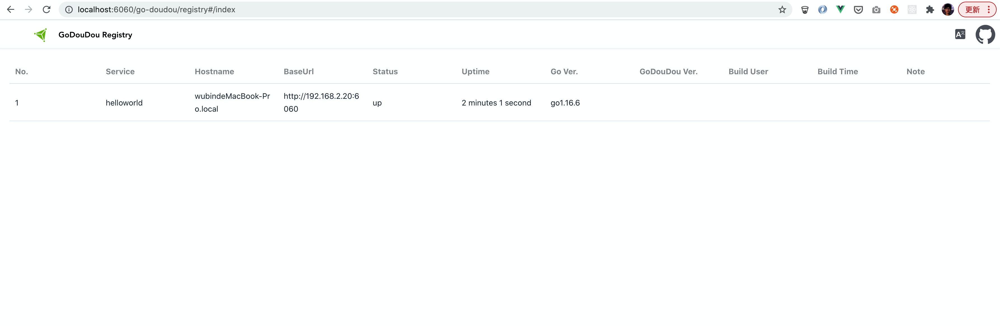
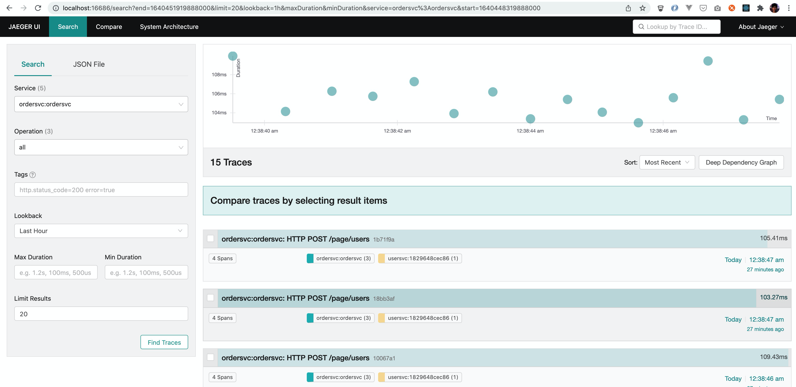
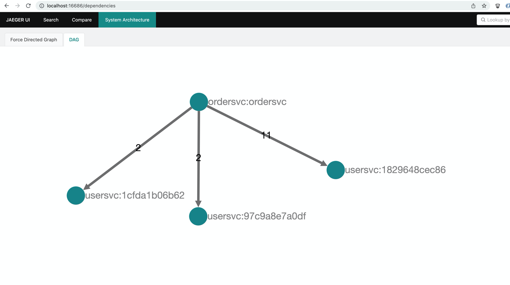

## go-doudou

[](https://github.com/avelino/awesome-go)
[](https://godoc.org/github.com/unionj-cloud/go-doudou)
[](https://travis-ci.com/unionj-cloud/go-doudou)
[](https://github.com/unionj-cloud/go-doudou/actions/workflows/go.yml)
[](https://codecov.io/gh/unionj-cloud/go-doudou)
[](https://goreportcard.com/report/github.com/unionj-cloud/go-doudou)
[](https://github.com/unionj-cloud/go-doudou)
[](https://goproxy.cn)
[](https://opensource.org/licenses/MIT)
[](https://join.slack.com/t/go-doudou/shared_invite/zt-vrhjndpd-0n2t0tKXssvpjoiF~8gJlQ)

[EN](./README.md) [中文](./README_zh.md)  
go-doudou（兜兜）是一个基于gossip协议和OpenAPI3.0规范的去中心化微服务框架。它同时支持单体应用。只支持restful服务。


<!-- START doctoc generated TOC please keep comment here to allow auto update -->
<!-- DON'T EDIT THIS SECTION, INSTEAD RE-RUN doctoc TO UPDATE -->
### TOC

  - [设计理念](#%E8%AE%BE%E8%AE%A1%E7%90%86%E5%BF%B5)
  - [特性](#%E7%89%B9%E6%80%A7)
  - [总览](#%E6%80%BB%E8%A7%88)
  - [推荐架构](#%E6%8E%A8%E8%8D%90%E6%9E%B6%E6%9E%84)
  - [Go版本兼容性](#go%E7%89%88%E6%9C%AC%E5%85%BC%E5%AE%B9%E6%80%A7)
  - [安装](#%E5%AE%89%E8%A3%85)
  - [用法](#%E7%94%A8%E6%B3%95)
  - [Hello World](#hello-world)
    - [初始化项目](#%E5%88%9D%E5%A7%8B%E5%8C%96%E9%A1%B9%E7%9B%AE)
    - [定义方法即设计restful接口](#%E5%AE%9A%E4%B9%89%E6%96%B9%E6%B3%95%E5%8D%B3%E8%AE%BE%E8%AE%A1restful%E6%8E%A5%E5%8F%A3)
    - [生成代码](#%E7%94%9F%E6%88%90%E4%BB%A3%E7%A0%81)
    - [运行](#%E8%BF%90%E8%A1%8C)
    - [Deployment](#deployment)
      - [docker镜像打包并推到你的远程仓库](#docker%E9%95%9C%E5%83%8F%E6%89%93%E5%8C%85%E5%B9%B6%E6%8E%A8%E5%88%B0%E4%BD%A0%E7%9A%84%E8%BF%9C%E7%A8%8B%E4%BB%93%E5%BA%93)
      - [部署](#%E9%83%A8%E7%BD%B2)
      - [关闭](#%E5%85%B3%E9%97%AD)
  - [必知](#%E5%BF%85%E7%9F%A5)
  - [Cors跨域](#cors%E8%B7%A8%E5%9F%9F)
  - [服务注册与发现](#%E6%9C%8D%E5%8A%A1%E6%B3%A8%E5%86%8C%E4%B8%8E%E5%8F%91%E7%8E%B0)
  - [客户端负载均衡](#%E5%AE%A2%E6%88%B7%E7%AB%AF%E8%B4%9F%E8%BD%BD%E5%9D%87%E8%A1%A1)
    - [简单轮询负载均衡算法](#%E7%AE%80%E5%8D%95%E8%BD%AE%E8%AF%A2%E8%B4%9F%E8%BD%BD%E5%9D%87%E8%A1%A1%E7%AE%97%E6%B3%95)
    - [平滑加权轮询负载均衡算法](#%E5%B9%B3%E6%BB%91%E5%8A%A0%E6%9D%83%E8%BD%AE%E8%AF%A2%E8%B4%9F%E8%BD%BD%E5%9D%87%E8%A1%A1%E7%AE%97%E6%B3%95)
  - [限流器](#%E9%99%90%E6%B5%81%E5%99%A8)
    - [用法](#%E7%94%A8%E6%B3%95-1)
    - [示例](#%E7%A4%BA%E4%BE%8B)
  - [隔仓](#%E9%9A%94%E4%BB%93)
    - [用法](#%E7%94%A8%E6%B3%95-2)
    - [示例](#%E7%A4%BA%E4%BE%8B-1)
  - [Jaeger](#jaeger)
    - [Screenshot](#screenshot)
  - [配置项](#%E9%85%8D%E7%BD%AE%E9%A1%B9)
  - [例子](#%E4%BE%8B%E5%AD%90)
  - [值得一提的工具](#%E5%80%BC%E5%BE%97%E4%B8%80%E6%8F%90%E7%9A%84%E5%B7%A5%E5%85%B7)
    - [name](#name)
    - [ddl](#ddl)
  - [TODO](#todo)
  - [社区](#%E7%A4%BE%E5%8C%BA)
- [License](#license)

<!-- END doctoc generated TOC please keep comment here to allow auto update -->

### 设计理念

- 设计优先: 我们建议先整体设计API，再着手开发
- 契约精神: 我们采用OpenAPI 3.0接口描述来规范前后端数据交换，降低前后端团队的沟通成本，提高团队生产力
- 去中心化: 我们采用gossip协议来做服务注册与发现来建设一个健壮的、可弹性伸缩的去中心化微服务集群。感谢hashicorp公司的开源库memberlist。

### 特性

- 低代码: 支持通过go语言接口类型生成包括但不限于main函数、路由、http handler、mock接口实现、http请求客户端和json格式的OpenAPI 3.0描述文件等等
- 支持DNS地址来做服务注册与发现
- 支持单体应用和微服务应用
- 内建客户端负载均衡（暂时只有round robin算法实现）
- 内建http server优雅停止
- 内建监听go文件变化重启服务（live reloading）(暂不支持windows平台)
- 内建基于OpenAPI3.0接口描述文件的在线接口文档
- 内建微服务集群的在线服务注册列表界面
- 内建prometheus监控指标中间件: http_requests_total, response_status and http_response_time_seconds
- 内建docker和kubernetes部署文件生成: dockerfile文件、deployment kind yaml文件和statefulset kind yaml文件
- 极易学习，上手简单

### 总览



### 推荐架构



### Go版本兼容性

- go 1.13, 1.14, 1.15，需要开启go module支持，GO111MODULE=on
- go 1.16+
- < go 1.13: 没有测试

### 安装

```shell
go get -v github.com/unionj-cloud/go-doudou@v0.9.1
```

如果遇到410 Gone报错，请尝试用下面的命令：

```shell
export GOSUMDB=off && go get -v github.com/unionj-cloud/go-doudou@v0.9.1
```

### 用法

```shell
➜  ~ go-doudou -h                            
WARN[0000] Error loading .env file: open /Users/.env: no such file or directory 
go-doudou works like a scaffolding tool but more than that. 
it lets api providers design their apis and help them code less. 
it generates openapi 3.0 spec json document for frontend developers or other api consumers to understand what apis there, 
consumers can import it into postman to debug and test, or upload it into some code generators to download client sdk.
it provides some useful components and middleware for constructing microservice cluster like service register and discovering, 
load balancing and so on. it just begins, more features will come out soon.

Usage:
  go-doudou [flags]
  go-doudou [command]

Available Commands:
  ddl         migration tool between database table structure and golang struct
  help        Help about any command
  name        bulk add or update struct fields json tag
  svc         generate or update service

Flags:
  -h, --help      help for go-doudou
  -v, --version   version for go-doudou

Use "go-doudou [command] --help" for more information about a command.
```

### Hello World

#### 初始化项目

```shell
➜  ~ go-doudou svc init helloworld
WARN[0000] Error loading .env file: open /Users/.env: no such file or directory 
1.16
helloworld
```

You can ignore the warning now.

```shell
➜  helloworld git:(master) ✗ ls -la -h
total 40
drwxr-xr-x   10 wubin1989  staff   320B  8 29 23:27 .
drwxr-xr-x+ 157 wubin1989  staff   4.9K  8 29 23:27 ..
-rw-r--r--    1 wubin1989  staff   2.0K  8 29 23:22 .env
drwxr-xr-x    5 wubin1989  staff   160B  8 29 23:26 .git
-rw-r--r--    1 wubin1989  staff   268B  8 29 23:22 .gitignore
drwxr-xr-x    6 wubin1989  staff   192B  8 29 23:27 .idea
-rw-r--r--    1 wubin1989  staff   707B  8 29 23:22 Dockerfile
-rw-r--r--    1 wubin1989  staff   442B  8 29 23:22 go.mod
-rw-r--r--    1 wubin1989  staff   253B  8 29 23:22 svc.go
drwxr-xr-x    3 wubin1989  staff    96B  8 29 23:22 vo
```

- Dockerfile：docker镜像打包文件

- svc.go: 在该文件里定义Helloworld接口的方法，就是定义需要暴露给前端的restful接口

- vo文件夹: 定义http请求体和返回体的结构体

- .env: 配置文件, go-doudou会加载里面配置的以`GDD_`开头的环境变量

#### 定义方法即设计restful接口

详情请阅读[Must Know](#must-know)

```go
package service

import (
	"context"
	"helloworld/vo"
)

type Helloworld interface {
	// You can define your service methods as your need. Below is an example.
	PageUsers(ctx context.Context, query vo.PageQuery) (code int, data vo.PageRet, err error)
}
```

#### 生成代码

```shell
go-doudou svc http --handler -c go -o --doc
go mod tidy
```

Let's see what are generated.

```shell
➜  helloworld git:(master) ✗ ls -la -h
total 328
drwxr-xr-x   20 wubin1989  staff   640B  8 31 12:34 .
drwxr-xr-x+ 157 wubin1989  staff   4.9K  8 31 12:36 ..
-rw-r--r--    1 wubin1989  staff   2.0K  8 29 23:45 .env
drwxr-xr-x    5 wubin1989  staff   160B  8 31 12:36 .git
-rw-r--r--    1 wubin1989  staff   268B  8 29 23:22 .gitignore
drwxr-xr-x    7 wubin1989  staff   224B  8 31 12:33 .idea
-rw-r--r--    1 wubin1989  staff   707B  8 29 23:22 Dockerfile
-rwxr-xr-x    1 wubin1989  staff    13K  8 31 12:35 app.log
drwxr-xr-x    3 wubin1989  staff    96B  8 29 23:44 client
drwxr-xr-x    3 wubin1989  staff    96B  8 29 23:44 cmd
drwxr-xr-x    3 wubin1989  staff    96B  8 29 23:44 config
drwxr-xr-x    3 wubin1989  staff    96B  8 29 23:44 db
-rw-r--r--    1 wubin1989  staff   536B  8 31 12:35 go.mod
-rw-r--r--    1 wubin1989  staff   115K  8 31 12:35 go.sum
-rwxr-xr-x    1 wubin1989  staff   1.9K  8 31 12:34 helloworld_openapi3.go
-rwxr-xr-x    1 wubin1989  staff   1.8K  8 31 12:34 helloworld_openapi3.json
-rw-r--r--    1 wubin1989  staff   253B  8 29 23:22 svc.go
-rw-r--r--    1 wubin1989  staff   413B  8 29 23:44 svcimpl.go
drwxr-xr-x    3 wubin1989  staff    96B  8 29 23:44 transport
drwxr-xr-x    3 wubin1989  staff    96B  8 29 23:22 vo
```

- helloworld_openapi3.json：OpenAPI 3.0 接口描述文件
- helloworld_openapi3.go: 里面定义了OpenAPI 3.0描述的json字符串，用于提供在线服务
- client文件夹：封装了[resty](https://github.com/go-resty/resty)这个库的http请求客户端代码
- cmd：里面有main函数，是整个应用的主入口
- config：配置文件相关
- db：数据库连接相关
- svcimpl.go：在里面写你的业务逻辑，即接口的具体实现
- transport：http路由和handler
- .env：配置文件

#### 运行

记得先把.env文件里的环境变量GDD_MEM_SEED设为空字符串，因为这是第一个服务节点，它自己就是种子节点。

```shell
➜  helloworld git:(master) ✗ go run cmd/main.go
INFO[2021-08-31 21:35:47] Node 192.168.2.20 joined, supplying helloworld service 
WARN[2021-08-31 21:35:47] No seed found                                
INFO[2021-08-31 21:35:47] Memberlist created. Local node is Node 192.168.2.20, providing helloworld service at http://192.168.2.20:6060, memberlist port 50324 
 _____                     _                    _
|  __ \                   | |                  | |
| |  \/  ___   ______   __| |  ___   _   _   __| |  ___   _   _
| | __  / _ \ |______| / _` | / _ \ | | | | / _` | / _ \ | | | |
| |_\ \| (_) |        | (_| || (_) || |_| || (_| || (_) || |_| |
 \____/ \___/          \__,_| \___/  \__,_| \__,_| \___/  \__,_|
INFO[2021-08-31 21:35:47] ================ Registered Routes ================ 
INFO[2021-08-31 21:35:47] +-------------+--------+-------------------------+ 
INFO[2021-08-31 21:35:47] |    NAME     | METHOD |         PATTERN         | 
INFO[2021-08-31 21:35:47] +-------------+--------+-------------------------+ 
INFO[2021-08-31 21:35:47] | PageUsers   | POST   | /page/users             | 
INFO[2021-08-31 21:35:47] | GetDoc      | GET    | /go-doudou/doc          | 
INFO[2021-08-31 21:35:47] | GetOpenAPI  | GET    | /go-doudou/openapi.json | 
INFO[2021-08-31 21:35:47] | Prometheus  | GET    | /go-doudou/prometheus   | 
INFO[2021-08-31 21:35:47] | GetRegistry | GET    | /go-doudou/registry     | 
INFO[2021-08-31 21:35:47] +-------------+--------+-------------------------+ 
INFO[2021-08-31 21:35:47] =================================================== 
INFO[2021-08-31 21:35:47] Started in 431.269µs                         
INFO[2021-08-31 21:35:47] Http server is listening on :6060
```




#### Deployment

##### docker镜像打包并推到你的远程仓库

```shell
➜  helloworld git:(master) ✗ go-doudou svc push -r wubin1989
[+] Building 0.8s (13/13) FINISHED                                                                                                       
 => [internal] load build definition from Dockerfile                                                                                0.0s
 => => transferring dockerfile: 37B                                                                                                 0.0s
 => [internal] load .dockerignore                                                                                                   0.0s
 => => transferring context: 2B                                                                                                     0.0s
 => [internal] load metadata for docker.io/library/golang:1.13.4-alpine                                                             0.0s
 => [1/8] FROM docker.io/library/golang:1.13.4-alpine                                                                               0.0s
 => [internal] load build context                                                                                                   0.7s
 => => transferring context: 22.43MB                                                                                                0.6s
 => CACHED [2/8] WORKDIR /repo                                                                                                      0.0s
 => CACHED [3/8] ADD go.mod .                                                                                                       0.0s
 => CACHED [4/8] ADD go.sum .                                                                                                       0.0s
 => CACHED [5/8] ADD . ./                                                                                                           0.0s
 => CACHED [6/8] RUN sed -i 's/dl-cdn.alpinelinux.org/mirrors.aliyun.com/g' /etc/apk/repositories                                   0.0s
 => CACHED [7/8] RUN apk add --no-cache bash tzdata                                                                                 0.0s
 => CACHED [8/8] RUN export GDD_VER=$(go list -mod=vendor -m -f '{{ .Version }}' github.com/unionj-cloud/go-doudou) && CGO_ENABLED  0.0s
 => exporting to image                                                                                                              0.0s
 => => exporting layers                                                                                                             0.0s
 => => writing image sha256:00365c58d0410d978aea462ec93323e20d879b15421e8eba29d8a17918660af8                                        0.0s
 => => naming to docker.io/library/helloworld                                                                                       0.0s

Use 'docker scan' to run Snyk tests against images to find vulnerabilities and learn how to fix them
The push refers to repository [docker.io/wubin1989/helloworld]
d0a9599b03e1: Pushed 
c3055fdf1a79: Layer already exists 
1c265a7f4c3e: Layer already exists 
f567cf5a5cf1: Layer already exists 
0b4acd902364: Layer already exists 
bbf9670b59e9: Layer already exists 
fdd6fb6fca5b: Layer already exists 
a17f85ec7605: Layer already exists 
2895b872dff5: Layer already exists 
eed8c158e67f: Layer already exists 
2033402d2275: Layer already exists 
77cae8ab23bf: Layer already exists 
v20210831125525: digest: sha256:5f75f7b43708d0619555f9bccbf0347e8db65319b83c65251015982ca6d23370 size: 2829
time="2021-08-31 12:55:53" level=info msg="image wubin1989/helloworld:v20210831125525 has been pushed successfully\n"
time="2021-08-31 12:55:53" level=info msg="k8s yaml has been created/updated successfully. execute command 'go-doudou svc deploy' to deploy service helloworld to k8s cluster\n"
```

然后你会看到生成了两个k8s部署文件。

```
➜  helloworld git:(master) ✗ ll
total 328
-rw-r--r--  1 wubin1989  staff   707B  8 29 23:22 Dockerfile
-rwxr-xr-x  1 wubin1989  staff    15K  8 31 12:55 app.log
drwxr-xr-x  3 wubin1989  staff    96B  8 29 23:44 client
drwxr-xr-x  3 wubin1989  staff    96B  8 29 23:44 cmd
drwxr-xr-x  3 wubin1989  staff    96B  8 29 23:44 config
drwxr-xr-x  3 wubin1989  staff    96B  8 29 23:44 db
-rw-r--r--  1 wubin1989  staff   536B  8 31 12:35 go.mod
-rw-r--r--  1 wubin1989  staff   115K  8 31 12:35 go.sum
-rw-r--r--  1 wubin1989  staff   817B  8 31 12:55 helloworld_deployment.yaml
-rwxr-xr-x  1 wubin1989  staff   1.9K  8 31 12:34 helloworld_openapi3.go
-rwxr-xr-x  1 wubin1989  staff   1.8K  8 31 12:34 helloworld_openapi3.json
-rw-r--r--  1 wubin1989  staff   867B  8 31 12:55 helloworld_statefulset.yaml
-rw-r--r--  1 wubin1989  staff   253B  8 29 23:22 svc.go
-rw-r--r--  1 wubin1989  staff   413B  8 29 23:44 svcimpl.go
drwxr-xr-x  3 wubin1989  staff    96B  8 29 23:44 transport
drwxr-xr-x  6 wubin1989  staff   192B  8 31 12:55 vendor
drwxr-xr-x  3 wubin1989  staff    96B  8 29 23:22 vo
```

- helloworld_deployment.yaml: 无状态的服务，推荐用于单体应用部署
- helloworld_statefulset.yaml: 有状态的服务，推荐用于微服务应用部署

##### 部署

```shell
go-doudou svc deploy 
```

##### 关闭

```shell
go-doudou svc shutdown
```

### 必知

当你在svc.go文件里定义方法（即restful接口）时，有几个需要注意和了解的地方：

1. 只支持GET, POST, PUT, DELETE四种http请求方法。如果方法名以Get/Post/Put/Delete开头, http请求方法就会是相对应的GET/POST/PUT/DELETE。
   如果方法名没有以其中任何一个开头, http请求方法默认为POST。
2. 任何一个方法的第一个入参的类型必须是context.Context。
3. 只支持Go语言[内建基本类型](https://golang.org/pkg/builtin/), 以string类型为key的字典, vo包中的结构体,
   相对应的切片和指针类型作为入参和出参。因为当go-doudou生成代码和OpenAPI3.0接口描述文件的时候，它只会扫描vo包下的结构体，如果入参或者出参里有来自vo包以外的其他结构体的话，go-doudou获取不到结构体字段信息。
4. 作为特例，go-doudou支持multipart.FileHeader类型来作为入参，用于上传文件，以及支持os.File类型作为出参，用于下载文件。
5. 不支持类型别名作为结构体字段类型。
6. 不支持函数类型，通道类型，接口类型和匿名结构体类型作为入参和出参。
7. 当执行命令`go-doudou svc http --handler`，handlerimpl.go里的已有代码不会被覆盖也不会被修改。如果你在svc.go文件里新增了方法，新代码会加到handlerimpl.go文件最后。
8. 当执行命令`go-doudou svc http --handler`，handler.go文件会重新生成，所以请不要在里面手动修改或者添加任何代码。
9. 当执行命令`go-doudou svc http`, 除了handler.go文件，go-doudou会先判断同名文件是否存在，如果不存在才会生成，存在就会跳过。

### Cors跨域
推荐使用 [github.com/rs/cors](github.com/rs/cors) 库。以下是示例代码。
```
corsOpts := cors.New(cors.Options{
    AllowedMethods: []string{
        http.MethodGet,
        http.MethodPost,
        http.MethodPut,
        http.MethodPatch,
        http.MethodDelete,
        http.MethodOptions,
        http.MethodHead,
    },

    AllowedHeaders: []string{
        "*",
    },
})

srv := ddhttp.NewDefaultHttpSrv()
srv.AddMiddleware(corsOpts.Handler, ddhttp.Tracing, ddhttp.Metrics, requestid.RequestIDHandler, handlers.CompressHandler, handlers.ProxyHeaders, ddhttp.Logger, ddhttp.Rest)
```

### 服务注册与发现

Go-doudou同时支持开发单体应用和微服务应用。

- `GDD_MODE=micro`：表示开启微服务应用模式
- `GDD_MODE=mono`：表示开启单体应用模式

### 客户端负载均衡

#### 简单轮询负载均衡算法

```go
package main

import (
	"fmt"
	"github.com/ascarter/requestid"
	"github.com/gorilla/handlers"
	"github.com/sirupsen/logrus"
	ddconfig "github.com/unionj-cloud/go-doudou/svc/config"
	ddhttp "github.com/unionj-cloud/go-doudou/svc/http"
	"github.com/unionj-cloud/go-doudou/svc/registry"
	service "ordersvc"
	"ordersvc/config"
	"ordersvc/transport/httpsrv"
	"usersvc/client"
)

func main() {
	ddconfig.InitEnv()
	conf := config.LoadFromEnv()

	err := registry.NewNode()
	if err != nil {
		logrus.Panicln(fmt.Sprintf("%+v", err))
	}
	defer registry.Shutdown()

	usersvcProvider := ddhttp.NewMemberlistServiceProvider("github.com/usersvc")
	usersvcClient := client.NewUsersvc(ddhttp.WithProvider(usersvcProvider))

	svc := service.NewOrdersvc(conf, nil, usersvcClient)

	handler := httpsrv.NewOrdersvcHandler(svc)
	srv := ddhttp.NewDefaultHttpSrv()
	srv.AddMiddleware(ddhttp.Tracing, ddhttp.Metrics, requestid.RequestIDHandler, handlers.CompressHandler, handlers.ProxyHeaders, ddhttp.Logger, ddhttp.Rest, ddhttp.Recover)
	srv.AddRoute(httpsrv.Routes(handler)...)
	srv.Run()
}
```

#### 平滑加权轮询负载均衡算法

如果没有设置环境变量GDD_MEM_WEIGHT，则每隔GDD_MEM_WEIGHT_INTERVAL，通过节点健康值和CPU空闲时间占比计算一次本地节点的权重。

```go
package main

import (
	"fmt"
	"github.com/ascarter/requestid"
	"github.com/gorilla/handlers"
	"github.com/sirupsen/logrus"
	ddconfig "github.com/unionj-cloud/go-doudou/svc/config"
	ddhttp "github.com/unionj-cloud/go-doudou/svc/http"
	"github.com/unionj-cloud/go-doudou/svc/registry"
	service "ordersvc"
	"ordersvc/config"
	"ordersvc/transport/httpsrv"
	"usersvc/client"
)

func main() {
	ddconfig.InitEnv()
	conf := config.LoadFromEnv()

	err := registry.NewNode()
	if err != nil {
		logrus.Panicln(fmt.Sprintf("%+v", err))
	}
	defer registry.Shutdown()

	usersvcProvider := ddhttp.NewSmoothWeightedRoundRobinProvider("github.com/usersvc")
	usersvcClient := client.NewUsersvc(ddhttp.WithProvider(usersvcProvider))

	svc := service.NewOrdersvc(conf, nil, usersvcClient)

	handler := httpsrv.NewOrdersvcHandler(svc)
	srv := ddhttp.NewDefaultHttpSrv()
	srv.AddMiddleware(ddhttp.Tracing, ddhttp.Metrics, requestid.RequestIDHandler, handlers.CompressHandler, handlers.ProxyHeaders, ddhttp.Logger, ddhttp.Rest, ddhttp.Recover)
	srv.AddRoute(httpsrv.Routes(handler)...)
	srv.Run()
}
```

### 限流器
#### 用法
go-doudou在`github.com/unionj-cloud/go-doudou/ratelimit`包中内置了基于[golang.org/x/time/rate](https://pkg.go.dev/golang.org/x/time/rate) 的令牌桶限流器。  
`MemoryStore`结构体用于存储key和`Limiter`接口实例对。使用时只需将`Limiter`实例的getter函数作为参数，传入`ratelimit.WithLimiterFn`，然后再一起
传入`ratelimit.NewMemoryStore`方法中，创建出一个`MemoryStore`实例。然后你就可以将这个实例传入自定义的中间件中根据你的业务需求实现限流的逻辑。  
如果你不喜欢内建的限流器实现，你也可以通过实现`Limiter`接口来创建自定义的限流器。  
另外，你还可以在调用`ratelimit.NewTokenLimiter`函数时，传入`ratelimit.WithTimer`函数，来给每一个创建出的`TokenLimiter`实例设置一个定时清理器。
设置这个定时器的目的是当这个`key`自从上一次发来请求之后，在参数`timeout`指定的时间范围内一直没有再次发来请求，则将这个`key`从`MemoryStore`中删除，以释放资源。

#### 示例

```go
package main

import (
	"fmt"
	"github.com/ascarter/requestid"
	"github.com/gorilla/handlers"
	"github.com/opentracing/opentracing-go"
	"github.com/sirupsen/logrus"
	"github.com/unionj-cloud/go-doudou/ratelimit"
	ddconfig "github.com/unionj-cloud/go-doudou/svc/config"
	ddhttp "github.com/unionj-cloud/go-doudou/svc/http"
	"github.com/unionj-cloud/go-doudou/svc/logger"
	"github.com/unionj-cloud/go-doudou/svc/registry"
	"github.com/unionj-cloud/go-doudou/svc/tracing"
	"time"
	service "usersvc"
	"usersvc/config"
	"usersvc/transport/httpsrv"
)

func main() {
	ddconfig.InitEnv()
	conf := config.LoadFromEnv()

	logger.Init()

	err := registry.NewNode()
	if err != nil {
		logrus.Panicln(fmt.Sprintf("%+v", err))
	}
	defer registry.Shutdown()

	tracer, closer := tracing.Init()
	defer closer.Close()
	opentracing.SetGlobalTracer(tracer)

	svc := service.NewUsersvc(conf)

	handler := httpsrv.NewUsersvcHandler(svc)
	srv := ddhttp.NewDefaultHttpSrv()

	store := ratelimit.NewMemoryStore(ratelimit.WithLimiterFn(func(store *ratelimit.MemoryStore, key string) ratelimit.Limiter {
		return ratelimit.NewTokenLimiter(1, 3, ratelimit.WithTimer(10*time.Second, func() {
			store.DeleteKey(key)
		}))
	}))

	srv.AddMiddleware(ddhttp.Tracing, ddhttp.Metrics, requestid.RequestIDHandler, handlers.CompressHandler, handlers.ProxyHeaders, httpsrv.RateLimit(store), ddhttp.Logger, ddhttp.Rest, ddhttp.Recover)
	srv.AddRoute(httpsrv.Routes(handler)...)
	srv.Run()
}
```

### 隔仓
#### 用法
go-doudou在`github.com/unionj-cloud/go-doudou/svc/http`包中内置了基于[github.com/slok/goresilience](github.com/slok/goresilience) 实现的隔仓模式中间件。

```go
http.BulkHead(3, 10*time.Millisecond)
```

例子中，第一个参数`3`表示goroutine池中worker的数量，第二个参数`10*time.Millisecond`表示一个请求进来以后到被执行的最长等待时间，超时直接返回`429`状态码。

#### 示例

```go
package main

import (
	"fmt"
	"github.com/ascarter/requestid"
	"github.com/gorilla/handlers"
	"github.com/opentracing/opentracing-go"
	"github.com/sirupsen/logrus"
	ddconfig "github.com/unionj-cloud/go-doudou/svc/config"
	ddhttp "github.com/unionj-cloud/go-doudou/svc/http"
	"github.com/unionj-cloud/go-doudou/svc/logger"
	"github.com/unionj-cloud/go-doudou/svc/registry"
	"github.com/unionj-cloud/go-doudou/svc/tracing"
	"time"
	service "usersvc"
	"usersvc/config"
	"usersvc/transport/httpsrv"
)

func main() {
	ddconfig.InitEnv()
	conf := config.LoadFromEnv()

	logger.Init()

	if ddconfig.GddMode.Load() == "micro" {
		err := registry.NewNode()
		if err != nil {
			logrus.Panicln(fmt.Sprintf("%+v", err))
		}
		defer registry.Shutdown()
	}

	tracer, closer := tracing.Init()
	defer closer.Close()
	opentracing.SetGlobalTracer(tracer)

	svc := service.NewUsersvc(conf)

	handler := httpsrv.NewUsersvcHandler(svc)
	srv := ddhttp.NewDefaultHttpSrv()

	srv.AddMiddleware(ddhttp.Tracing, ddhttp.Metrics, ddhttp.BulkHead(3, 10*time.Millisecond), requestid.RequestIDHandler, handlers.CompressHandler, handlers.ProxyHeaders, ddhttp.Logger, ddhttp.Rest, ddhttp.Recover)
	srv.AddRoute(httpsrv.Routes(handler)...)
	srv.Run()
}
```

### Jaeger
集成Jaeger，你只需要以下3步：
1. 启动Jaeger
```shell
docker run -d --name jaeger \
  -p 6831:6831/udp \
  -p 16686:16686 \
  jaegertracing/all-in-one:1.29
```
2. 在.env文件里加入以下两个环境变量
```shell
JAEGER_AGENT_HOST=localhost
JAEGER_AGENT_PORT=6831
```
3. main函数里加入以下三行代码
```go
tracer, closer := tracing.Init()
defer closer.Close()
opentracing.SetGlobalTracer(tracer)
```
此时，你的main函数会像这样：
```go
package main

import (
	"fmt"
	"github.com/ascarter/requestid"
	"github.com/gorilla/handlers"
	"github.com/opentracing/opentracing-go"
	"github.com/sirupsen/logrus"
	ddconfig "github.com/unionj-cloud/go-doudou/svc/config"
	ddhttp "github.com/unionj-cloud/go-doudou/svc/http"
	"github.com/unionj-cloud/go-doudou/svc/logger"
	"github.com/unionj-cloud/go-doudou/svc/registry"
	"github.com/unionj-cloud/go-doudou/svc/tracing"
	service "ordersvc"
	"ordersvc/config"
	"ordersvc/transport/httpsrv"
	"usersvc/client"
)

func main() {
	ddconfig.InitEnv()
	conf := config.LoadFromEnv()

	logger.Init()

	err := registry.NewNode()
	if err != nil {
		logrus.Panicln(fmt.Sprintf("%+v", err))
	}
	defer registry.Shutdown()

	tracer, closer := tracing.Init()
	defer closer.Close()
	opentracing.SetGlobalTracer(tracer)

	usersvcProvider := ddhttp.NewSmoothWeightedRoundRobinProvider("usersvc")
	usersvcClient := client.NewUsersvc(ddhttp.WithProvider(usersvcProvider))

	svc := service.NewOrdersvc(conf, nil, usersvcClient)

	handler := httpsrv.NewOrdersvcHandler(svc)
	srv := ddhttp.NewDefaultHttpSrv()
	srv.AddMiddleware(ddhttp.Tracing, ddhttp.Metrics, requestid.RequestIDHandler, handlers.CompressHandler, handlers.ProxyHeaders, ddhttp.Logger, ddhttp.Rest, ddhttp.Recover)
	srv.AddRoute(httpsrv.Routes(handler)...)
	srv.Run()
}
```
#### Screenshot




### 配置项

go-doudou用.env文件管理框架用到的环境变量

| 环境变量    | 描述                                                                                                                                                                                      | 默认值       | 是否必须 |
| ----------------------- |-----------------------------------------------------------------------------------------------------------------------------------------------------------------------------------------|-----------| -------- |
| GDD_BANNER              | 是否在控制台打印banner                                                                                                                                                                          | off       |          |
| GDD_BANNER_TEXT         | banner文本                                                                                                                                                                                | Go-doudou |          |
| GDD_LOG_LEVEL           | 日志等级：可能的值有panic, fatal, error, warn, warning, info, debug, trace                                                                                                                        | info      |          |
| GDD_LOG_PATH            | 如果配置文件里没有出现GDD_LOG_PATH这个环境变量，则没有日志文件输出到磁盘                                                                                                                                              |           |          |
| GDD_GRACE_TIMEOUT       | 优雅关闭的超时时间                                                                                                                                                                               | 15s       |          |
| GDD_WRITE_TIMEOUT       | http服务器的写操作超时时间                                                                                                                                                                         | 15s       |          |
| GDD_READ_TIMEOUT        | http服务器的读操作超时时间                                                                                                                                                                         | 15s       |          |
| GDD_IDLE_TIMEOUT        | http服务器的空闲连接超时时间                                                                                                                                                                        | 60s       |          |
| GDD_ROUTE_ROOT_PATH     | 接口请求路径的前缀                                                                                                                                                                               | ""        |          |
| GDD_SERVICE_NAME        | 注册服务到集群时的服务名称                                                                                                                                                                           |           | Yes      |
| GDD_HOST                | http服务器监听地址                                                                                                                                                                             | ""        |          |
| GDD_PORT                | http服务器监听端口                                                                                                                                                                             | ""        |          |
| GDD_MODE                | "mono"表示单体应用，"micro"表示微服务应用                                                                                                                                                             |           |          |
| GDD_MANAGE_ENABLE       | 开启管理端点，如：/go-doudou/doc, /go-doudou/openapi.json, /go-doudou/prometheus和/go-doudou/registry。                                                                                            | false     |          |
| GDD_MANAGE_USER         | 管理端点的basic auth校验的用户名                                                                                                                                                                   | ""        |          |
| GDD_MANAGE_PASS         | 管理端点的basic auth校验的密码                                                                                                                                                                    | ""        |          |
| GDD_MEM_SEED            | 种子节点的地址。如果没有设置或者设置为空字符串，则创建一个新的memberlist集群，供其他节点来加入                                                                                                                                    | ""        |          |
| GDD_MEM_NAME            | 节点名称。仅用于本地开发和调试。如果没有设置或者值为空字符串，则取服务器的hostname                                                                                                                                           | ""        |          |
| GDD_MEM_HOST            | 设置memberlist的AdvertiseAddr属性。如果GDD_MEM_HOST的值以点开头，如：.seed-svc-headless.default.svc.cluster.local，则会在前面补上服务器的hostname，如：seed-2.seed-svc-headless.default.svc.cluster.local，用于支持k8s的有状态服务 | ""        |          |
| GDD_MEM_PORT            | 如果没有设置或者值为空字符串，则会设置为一个随机取得的可用端口。推荐自己设置一个端口                                                                                                                                              | ""        |          |
| GDD_MEM_DEAD_TIMEOUT    | 如果在GDD_MEM_DEAD_TIMEOUT设置的超时时间范围内，没有收到已经判定为dead的节点的复活消息，则会从缓存里把这个节点信息彻底删掉                                                                                                               | 30        |          |
| GDD_MEM_SYNC_INTERVAL   | 每隔GDD_MEM_SYNC_INTERVAL，本地节点会随机选择一个远程节点做数据同步                                                                                                                                            | 10s       |          |
| GDD_MEM_RECLAIM_TIMEOUT | 如果超过GDD_MEM_RECLAIM_TIMEOUT，被判定为dead的节点会被具有相同名称但具有不同地址的节点替换掉                                                                                                                            | 3         |          |
| GDD_MEM_PROBE_INTERVAL | 每隔GDD_MEM_PROBE_INTERVAL做一次心跳检测                                                                                                                                                         | 5s        |          |
| GDD_MEM_PROBE_TIMEOUT | 一次心跳检测的超时时间                                                                                                                                                                             | 3s        |          |
| GDD_MEM_TCP_TIMEOUT | 一次TCP请求的超时时间                                                                                                                                                                            | 30s       |          |
| GDD_MEM_GOSSIP_NODES | 设置一次批量发送gossip消息的目标节点的数量                                                                                                                                                                | 4         |          |
| GDD_MEM_GOSSIP_INTERVAL | 每隔GDD_MEM_GOSSIP_INTERVAL批量发送一次gossip消息                                                                                                                                                 | 500ms     |          |
| GDD_MEM_SUSPICION_MULT | 计算一个节点从心跳检测失败到宣告该节点已经挂掉的时长的系数                                                                                                                                                           | 6         |          |
| GDD_MEM_WEIGHT | 平滑加权轮询负载均衡算法的权重                                                                                                                                                                         | 0         |          |
| GDD_MEM_WEIGHT_INTERVAL | 每隔GDD_MEM_WEIGHT_INTERVAL，计算一次节点权重                                                                                                                                                      | 5s        |          |
| GDD_RETRY_COUNT | resty客户端重试次数                                                                                                                                                                            | 0         |          |

### 例子

请参考 [go-doudou-guide](https://gitee.com/unionj-cloud/go-doudou-guide)

### 值得一提的工具

#### name

可以一把生成或者替换结构体字段的json标签的命令行工具。 请参考[文档](./name/README_zh.md)。

#### ddl

封装了[jmoiron/sqlx](https://github.com/jmoiron/sqlx)
的从结构体生成或者更新mysql数据库表结构，或者反过来，从数据库表结构生成结构体的命令行工具。请参考[文档](./ddl/doc/README_zh.md)。

### TODO

请参考 [go-doudou看板](https://github.com/unionj-cloud/go-doudou/projects/1)

### 社区

欢迎通过fork或者提交pr和issue来参与go-doudou项目。 如果你喜欢go-doudou，请记得点个星！

欢迎联系我：

- facebook: [https://www.facebook.com/bin.wu.94617999/](https://www.facebook.com/bin.wu.94617999/)
- twitter: [https://twitter.com/BINWU49205513](https://twitter.com/BINWU49205513)
- 邮箱地址: 328454505@qq.com
- 微信二维码:  
  

## License

MIT