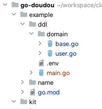
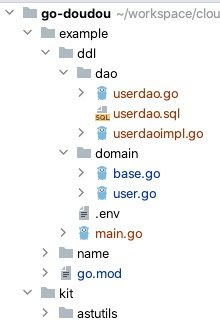
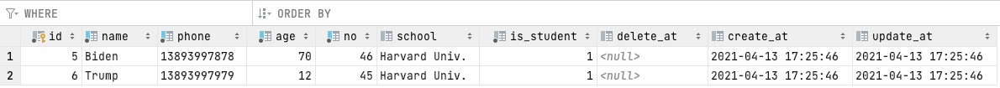

## ddl

基于[jmoiron/sqlx](https://github.com/jmoiron/sqlx)实现的同步数据库表结构和Go结构体的工具。暂不支持索引的更新，不支持外键。


<!-- START doctoc generated TOC please keep comment here to allow auto update -->
<!-- DON'T EDIT THIS SECTION, INSTEAD RE-RUN doctoc TO UPDATE -->
### TOC

- [快速上手](#%E5%BF%AB%E9%80%9F%E4%B8%8A%E6%89%8B)
- [命令行参数](#%E5%91%BD%E4%BB%A4%E8%A1%8C%E5%8F%82%E6%95%B0)
- [API](#api)
  - [示例](#%E7%A4%BA%E4%BE%8B)
  - [结构体标签](#%E7%BB%93%E6%9E%84%E4%BD%93%E6%A0%87%E7%AD%BE)
    - [pk](#pk)
    - [auto](#auto)
    - [type](#type)
    - [default](#default)
    - [extra](#extra)
    - [index](#index)
    - [unique](#unique)
    - [null](#null)
    - [unsigned](#unsigned)
  - [dao层接口](#dao%E5%B1%82%E6%8E%A5%E5%8F%A3)
    - [InsertXXX](#insertxxx)
    - [UpsertXXX](#upsertxxx)
    - [UpsertXXXNoneZero](#upsertxxxnonezero)
    - [DeleteXXXs](#deletexxxs)
    - [UpdateXXX](#updatexxx)
    - [UpdateXXXNoneZero](#updatexxxnonezero)
    - [UpdateXXXs](#updatexxxs)
    - [UpdateXXXsNoneZero](#updatexxxsnonezero)
    - [GetXXX](#getxxx)
    - [SelectXXXs](#selectxxxs)
    - [CountXXXs](#countxxxs)
    - [PageXXXs](#pagexxxs)
  - [查询Dsl](#%E6%9F%A5%E8%AF%A2dsl)
    - [示例](#%E7%A4%BA%E4%BE%8B-1)
    - [API](#api-1)
      - [Q接口](#q%E6%8E%A5%E5%8F%A3)
      - [criteria结构体](#criteria%E7%BB%93%E6%9E%84%E4%BD%93)
      - [where结构体](#where%E7%BB%93%E6%9E%84%E4%BD%93)
      - [Page结构体](#page%E7%BB%93%E6%9E%84%E4%BD%93)
- [TODO](#todo)

<!-- END doctoc generated TOC please keep comment here to allow auto update -->


### 快速上手

- ```
  git clone git@github.com:unionj-cloud/go-doudou.git
  ```

- ```
  cd go-doudou/example
  ```

- 当前example目录结构

  

- ```
  go-doudou ddl --dao --pre=biz_ --domain=ddl/domain --env=ddl/.env
  ```

- 执行以上命令后example目录结构

  

  生成的表结构


- ```
   go run ddl/main.go
  ```

  可以看到命令行输出

  ```
  ➜  example git:(main) ✗ go run ddl/main.go
  INFO[2021-04-13 17:52:42] {Items:[{ID:5 Name:Biden Phone:13893997878 Age:70 No:46 School:Harvard Univ. IsStudent:true Base:{CreateAt:2021-04-13 17:25:46 +0800 CST UpdateAt:2021-04-13 17:25:46 +0800 CST DeleteAt:<nil>}}] PageNo:1 PageSize:1 Total:1 HasNext:false} 
  ```

  

  数据库表里插入两条记录

  

  

### 命令行参数

```
➜  ~ go-doudou ddl -h
A longer description that spans multiple lines and likely contains examples
and usage of using your command. For example:

Cobra is a CLI library for Go that empowers applications.
This application is a tool to generate the needed files
to quickly create a Cobra application.

Usage:
  go-doudou ddl [flags]

Flags:
  -d, --dao             If true, generate dao code.
      --df string       Name of dao folder. (default "dao")
      --domain string   Path of domain folder. (default "domain")
      --env string      Path of database connection config .env file (default ".env")
  -h, --help            help for ddl
      --pre string      Table name prefix. e.g.: prefix biz_ for biz_product.
  -r, --reverse         If true, generate domain code from database. If false, update or create database tables from domain code.

Global Flags:
      --config string   config file (default is $HOME/.go-doudou.yaml)
```


### API

#### 示例

```
//dd:table
type User struct {
	ID        int    `dd:"pk;auto"`
	Name      string `dd:"index:name_phone_idx,2;default:'jack'"`
	Phone     string `dd:"index:name_phone_idx,1;default:'13552053960';extra:comment '手机号'"`
	Age       int    `dd:"index"`
	No        int    `dd:"unique"`
	School    string `dd:"null;default:'harvard';extra:comment '学校'"`
	IsStudent bool

	Base
}
```

- 结构体定义上方需加注释"//dd:table"
- 结构体字段标签名为"dd"


#### 结构体标签

##### pk

表示主键

##### auto

表示自增

##### type

表示数据库字段类型。非必填。默认映射规则如下表：

| 支持的Go语言类型（含指针） | 数据库字段类型 |
| :------------------------: | :------------: |
|            Int             |      Int       |
|           Int64            |     bigint     |
|          float32           |     Float      |
|          float64           |     Double     |
|           string           |  varchar(255)  |
|            bool            |    tinyint     |
|         time.Time          |    datetime    |

##### default

表示默认值。需自己区分数据库内建函数还是字面量。如果是数据库内建函数或者是由数据库内建函数组成的表达式，则不需要带单引号。如果是字面量，则需要自己加上单引号。

##### extra

表示其他字段信息，比如"on update CURRENT_TIMESTAMP"，"comment '手机号'"  
**注意：因为ddl工具使用英文";"和":"来解析标签，所以comment中请勿使用英文";"和":"**

##### index

表示索引

- 格式："index:索引名称,排序,升降序" 或者 "index"
- 索引名称：字符串。如果多个字段用同一个索引名称，表示该索引是联合索引。非必填。如果没有声明索引名称，则默认名称为：column名称+_idx
- 排序：整型。如果声明了索引名称，则必填
- 升降序：字符串。只支持"asc"和"desc"。非必填。默认"asc"

##### unique

表示唯一索引。格式和用法同index

##### null

表示可以存入null值。注意：如果是该结构体字段的类型是指针类型，则默认是nullable的

##### unsigned

表示无符号


#### dao层接口

##### InsertXXX

插入记录

##### UpsertXXX

如果存在冲突的字段值，比如主键值或者加了唯一索引的字段值，则执行更新操作，否则执行插入操作

##### UpsertXXXNoneZero

同UpsertXXX。区别是只插入或者更新非Go语言规范定义的非[零值](https://golang.org/ref/spec#The_zero_value)

##### DeleteXXXs

删除多条记录

##### UpdateXXX

更新记录

##### UpdateXXXNoneZero

同UpdateXXX。区别是只更新非Go语言规范定义的非[零值](https://golang.org/ref/spec#The_zero_value)

##### UpdateXXXs

更新多条记录

##### UpdateXXXsNoneZero

同UpdateXXXs。区别是只更新非Go语言规范定义的非[零值](https://golang.org/ref/spec#The_zero_value)

##### GetXXX

查询记录

##### SelectXXXs

查询多条记录

##### CountXXXs

Count多条记录

##### PageXXXs

分页


#### 查询Dsl

##### 示例

```go
func ExampleCriteria() {
	
	query := C().Col("name").Eq(Literal("wubin")).
              Or(C().Col("school").Eq(Literal("havard"))).
              And(C().Col("age").Eq(Literal(18)))
	fmt.Println(query.Sql())

	query = C().Col("name").Eq(Literal("wubin")).
              Or(C().Col("school").Eq(Literal("havard"))).
              And(C().Col("delete_at").IsNotNull())
	fmt.Println(query.Sql())

	query = C().Col("name").Eq(Literal("wubin")).
              Or(C().Col("school").In(Literal("havard"))).
              And(C().Col("delete_at").IsNotNull())
	fmt.Println(query.Sql())

	query = C().Col("name").Eq(Literal("wubin")).
              Or(C().Col("school").In(Literal([]string{"havard", "beijing unv"}))).
              And(C().Col("delete_at").IsNotNull())
	fmt.Println(query.Sql())

	var d int
	var e int
	d = 10
	e = 5

	query = C().Col("name").Eq(Literal("wubin")).
              Or(C().Col("age").In(Literal([]*int{&d, &e}))).
              And(C().Col("delete_at").IsNotNull())
	fmt.Println(query.Sql())

	// Output:
	// ((`name` = 'wubin' or `school` = 'havard') and `age` = '18')
	// ((`name` = 'wubin' or `school` = 'havard') and `delete_at` is not null)
	// ((`name` = 'wubin' or `school` in ('havard')) and `delete_at` is not null)
	// ((`name` = 'wubin' or `school` in ('havard','beijing unv')) and `delete_at` is not null)
	// ((`name` = 'wubin' or `age` in ('10','5')) and `delete_at` is not null)
}
```


##### API

主要包括1个接口和6个结构体


###### Q接口

```go
type Q interface {
	Sql() string
	And(q Q) Q
	Or(q Q) Q
}
```

- 调用Sql方法返回最终拼接而成的where语句

- And方法表示sql里的"and"

- Or方法表示sql里的"or"

  

###### criteria结构体

```go
type criteria struct {
	col  string
	val  Val
	asym arithsymbol.ArithSymbol
}
```

- col表示表字段名称
- val表示表字段值
- asym表示算数运算符，可选值：
  - Eq: `=`
  - Ne: `!=`
  - Gt: `>`
  - Lt: `<`
  - Gte: `>=`
  - Lte: `<=`
  - Is: `is`
  - Not: `is not`
  - In: `in`


Val结构体

```go
type Val struct {
	Data interface{}
	Type valtypeenum.ValType
}
```

- Data表示表字段值
- Type表示值类型，可选值
  - Func: 表示数据库内建函数或由内建函数构成的表达式
  - Null: 表示数据库的null
  - Literal: 表示区别于Func和Null的值


###### where结构体

```
type where struct {
   lsym     logicsymbol.LogicSymbol
   children []Q
}
```

- lsym表示逻辑运算符，可选值：
  - And: `and`
  - Or: `or`
- children表示子查询条件，通过lsym表示的逻辑关系构成组，每两个子条件为一组。每一个子条件既可以是一个`criteria`，也可以是一个`where`。只要实现了Q接口就可以做一个子条件，通过lsym与另外一个子条件构成一组。


###### Page结构体

```go
type Page struct {
	Orders []Order
	Offset int
	Size   int
}
```

- Orders表示排序
- Offset表示偏移
- Size表示一页有多少行


Order结构体

```go
type Order struct {
	Col  string
	Sort sortenum.Sort
}
```

- Col表示表字段
- Sort表示升降序, 可选值：asc/desc


PageRet结构体

```go
type PageRet struct {
	Items    interface{}
	PageNo   int
	PageSize int
	Total    int
	HasNext  bool
}
```

- Items表示行数据
- PageNo表示当前页页码
- PageSize表示一页有多少行
- Total表示总数
- HasNext表示是否有下一页


### TODO

+ [ ] 支持索引的更新
+ [ ] 支持外键


