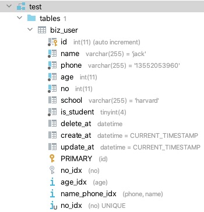

## ddl


### 快速上手

- ```
  git clone git@github.com:unionj-cloud/go-doudou.git
  ```

- ```
  cd go-doudou/example
  ```

- 当前example目录结构

  

- ```
  ddl -dao -pre=biz_ -domain=ddl/domain -env=ddl/.env
  ```

- 执行以上命令后example目录结构

  

  生成的表结构



- ```
   go run ddl/main.go
  ```

  可以看到命令行输出

  ```
  ➜  example git:(main) ✗ go run ddl/main.go
  INFO[2021-04-13 17:52:42] {Items:[{ID:5 Name:Biden Phone:13893997878 Age:70 No:46 School:Harvard Univ. IsStudent:true Base:{CreateAt:2021-04-13 17:25:46 +0800 CST UpdateAt:2021-04-13 17:25:46 +0800 CST DeleteAt:<nil>}}] PageNo:1 PageSize:1 Total:1 HasNext:false} 
  ```

  

  数据库表里插入两条记录

  

  

### 命令行参数

```
➜  example git:(main) ✗ ddl -help
Usage of ddl:
  -dao
    	If true, generate dao code.
  -daofolder string
    	Name of dao folder. (default "dao")
  -domain string
    	Path of domain folder. (default "domain")
  -env string
    	Path of database connection config .env file (default ".env")
  -pre string
    	Table name prefix. e.g.: prefix biz_ for biz_product.
  -reverse
    	If true, generate domain code from database. If false, update or create database tables from domain code.
```


### API

#### 示例：

```
//dd:table
type User struct {
	ID        int    `dd:"pk;auto"`
	Name      string `dd:"index:name_phone_idx,2;default:'jack'"`
	Phone     string `dd:"index:name_phone_idx,1;default:'13552053960';extra:comment '手机号'"`
	Age       int    `dd:"index"`
	No        int    `dd:"unique"`
	School    string `dd:"null;default:'harvard';extra:comment '学校'"`
	IsStudent bool

	Base
}
```

- 结构体定义上方需加注释"//dd:table"
- 结构体字段标签名为"dd"


#### 结构体标签

- pk: 表示主键

- auto: 表示自增

- type: 表示数据库字段类型。非必填。默认映射规则如下表：

  | 支持的Go语言类型（含指针） | 数据库字段类型 |
  | :------------------------: | :------------: |
  |            Int             |      Int       |
  |           Int64            |     bigint     |
  |          float32           |     Float      |
  |          float64           |     Double     |
  |           string           |  varchar(255)  |
  |            bool            |    tinyint     |
  |         time.Time          |    datetime    |

- default: 表示默认值。需自己区分数据库内建函数还是字面量。如果是数据库内建函数或者是由数据库内建函数组成的表达式，则不需要带单引号。如果是字面量，则需要自己加上单引号。

- extra: 表示其他字段信息，比如"on update CURRENT_TIMESTAMP"，"comment '手机号'"

- index: 表示索引

  - 格式："index:索引名称,排序,升降序" 或者 "index"
  - 索引名称：字符串。如果多个字段用同一个索引名称，表示该索引是联合索引。非必填。如果没有声明索引名称，则默认名称为：column名称+_idx
  - 排序：整型。如果声明了索引名称，则必填
  - 升降序：字符串。只支持"asc"和"desc"。非必填。默认"asc"

- unique: 表示唯一索引。格式和用法同index
- null: 表示可以存入null值。注意：如果是该结构体字段的类型是指针类型，则默认是nullable的
- unsigned: 表示无符号


#### dao层接口

- InsertXXX: 插入记录
- UpsertXXX: 如果存在冲突的字段值，比如主键值或者加了唯一索引的字段值，则执行更新操作，否则执行插入操作
- UpsertXXXNoneZero: 同UpsertXXX。区别是只插入或者更新非Go语言规范定义的非[零值](https://golang.org/ref/spec#The_zero_value)
- DeleteXXXs: 删除多条记录
- UpdateXXX: 更新记录
- UpdateXXXNoneZero: 同UpdateXXX。区别是只更新非Go语言规范定义的非[零值](https://golang.org/ref/spec#The_zero_value)
- UpdateXXXs: 更新多条记录
- UpdateXXXsNoneZero: 同UpdateXXXs。区别是只更新非Go语言规范定义的非[零值](https://golang.org/ref/spec#The_zero_value)
- GetXXX: 查询记录
- SelectXXXs: 查询多条记录
- CountXXXs: Count多条记录
- PageXXXs: 分页


#### 查询Dsl


